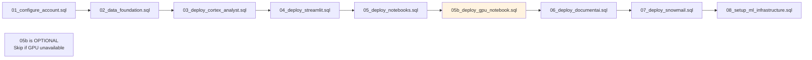

# Git Integration Deployment Guide

## Deploy Directly from GitHub in Snowflake UI

Instead of downloading files or using SnowCLI, you can connect Snowflake directly to this GitHub repository and run scripts from within Snowsight!

---

## 🚀 Quick Start (3 Steps)

### Step 1: Setup Git Integration

In Snowflake UI, open a SQL worksheet and run:

```sql
-- Run this file from GitHub or copy/paste:
-- https://github.com/Snowflake-Labs/sfguide-Build-an-AI-Assistant-for-FSI-with-AISQL-and-Snowflake-Intelligence/blob/main/assets/sql/00_setup_git_integration.sql
```

Or manually create integration:

```sql
USE ROLE ACCOUNTADMIN;

-- Create API integration for GitHub
CREATE OR REPLACE API INTEGRATION git_api_integration
    API_PROVIDER = git_https_api
    API_ALLOWED_PREFIXES = ('https://github.com/Snowflake-Labs/')
    ENABLED = TRUE;

-- Create Git repository object
CREATE OR REPLACE GIT REPOSITORY ACCELERATE_AI_IN_FSI_REPO
    API_INTEGRATION = git_api_integration
    ORIGIN = 'https://github.com/Snowflake-Labs/sfguide-Build-an-AI-Assistant-for-FSI-with-AISQL-and-Snowflake-Intelligence.git';

-- Fetch code from GitHub
ALTER GIT REPOSITORY ACCELERATE_AI_IN_FSI_REPO FETCH;
```

✅ **Done!** The repository is now connected to Snowflake.

---

### Step 2: Navigate to Git Repositories

1. In Snowsight, go to **Projects** → **Git Repositories**
2. Click on **ACCELERATE_AI_IN_FSI_REPO**
3. You'll see the repository files from GitHub

---

### Step 3: Run Deployment Scripts

Navigate to `assets/sql/` folder in the Git browser.

**Execute scripts in order (01 → 08):**



---

## 📋 Deployment Methods

### Method A: Execute Immediately from Git (Fastest)

Open a SQL worksheet and run:

```sql
-- Execute scripts directly from Git repository
EXECUTE IMMEDIATE FROM @ACCELERATE_AI_IN_FSI_REPO/branches/main/assets/sql/01_configure_account.sql;
EXECUTE IMMEDIATE FROM @ACCELERATE_AI_IN_FSI_REPO/branches/main/assets/sql/02_data_foundation.sql;
EXECUTE IMMEDIATE FROM @ACCELERATE_AI_IN_FSI_REPO/branches/main/assets/sql/03_deploy_cortex_analyst.sql;
EXECUTE IMMEDIATE FROM @ACCELERATE_AI_IN_FSI_REPO/branches/main/assets/sql/04_deploy_streamlit.sql;
EXECUTE IMMEDIATE FROM @ACCELERATE_AI_IN_FSI_REPO/branches/main/assets/sql/05_deploy_notebooks.sql;

-- OPTIONAL: Only if GPU available in your region
EXECUTE IMMEDIATE FROM @ACCELERATE_AI_IN_FSI_REPO/branches/main/assets/sql/05b_deploy_gpu_notebook.sql;

EXECUTE IMMEDIATE FROM @ACCELERATE_AI_IN_FSI_REPO/branches/main/assets/sql/06_deploy_documentai.sql;
EXECUTE IMMEDIATE FROM @ACCELERATE_AI_IN_FSI_REPO/branches/main/assets/sql/07_deploy_snowmail.sql;
EXECUTE IMMEDIATE FROM @ACCELERATE_AI_IN_FSI_REPO/branches/main/assets/sql/08_setup_ml_infrastructure.sql;
```

**Time**: 15-20 minutes  
**Benefit**: One SQL worksheet, runs everything sequentially

---

### Method B: Use Git Repositories UI (Interactive)

1. **Navigate**: Projects → Git Repositories → ACCELERATE_AI_IN_FSI_REPO
2. **Browse**: Click on `assets/sql/`
3. **Open**: Right-click `01_configure_account.sql` → "Open in new worksheet"
4. **Run**: Click the Run button
5. **Repeat**: For scripts 02-08 (and optionally 05b)

**Time**: 15-20 minutes  
**Benefit**: Visual feedback, step-by-step control

---

### Method C: Create Worksheets from Git Files

1. In Git Repositories, navigate to `assets/sql/01_configure_account.sql`
2. Click "..." menu → "Create worksheet from file"
3. Execute the worksheet
4. Repeat for each script (02-08)

**Time**: 15-20 minutes  
**Benefit**: Keep worksheets for later reference

---

## 🔄 Keep Repository Updated

To pull latest changes from GitHub:

```sql
USE ROLE ACCOUNTADMIN;

-- Fetch latest code
ALTER GIT REPOSITORY ACCELERATE_AI_IN_FSI_REPO FETCH;

-- Check for updates
SHOW GIT BRANCHES IN ACCELERATE_AI_IN_FSI_REPO;
```

---

## 📊 Verify Git Integration

```sql
-- List SQL scripts available
LS @ACCELERATE_AI_IN_FSI_REPO/branches/main/assets/sql/;

-- Expected output:
-- 00_config.sql
-- 01_configure_account.sql
-- 02_data_foundation.sql
-- 03_deploy_cortex_analyst.sql
-- 04_deploy_streamlit.sql
-- 05_deploy_notebooks.sql
-- 05b_deploy_gpu_notebook.sql (optional)
-- 06_deploy_documentai.sql
-- 07_deploy_snowmail.sql
-- 08_setup_ml_infrastructure.sql
```

---

## ✅ Benefits of Git Integration

### vs. Downloading Files
- ✅ No downloads needed
- ✅ Always latest version
- ✅ One-click updates (FETCH)
- ✅ Version control visible in Snowflake

### vs. SnowCLI
- ✅ No CLI installation
- ✅ Works entirely in browser
- ✅ Visual file browser
- ✅ Integrated with Snowsight

### vs. Copy/Paste
- ✅ No manual copying
- ✅ See full file structure
- ✅ Browse documentation
- ✅ Track which version deployed

---

## 📖 PUT Command Handling

**Important**: When running from Git integration, PUT commands work differently:

### Files in Git Repository

PUT commands reference files relative to Git repository root:

```sql
-- This works when executed from Git:
PUT file:///../data/email_previews_data.csv @stage ...
```

The path resolves to: `@ACCELERATE_AI_IN_FSI_REPO/branches/main/assets/data/`

### How Snowflake Handles This

1. **Script location**: `assets/sql/02_data_foundation.sql`
2. **Relative path**: `/../data/email_previews_data.csv`
3. **Resolves to**: `assets/data/email_previews_data.csv` in Git repo
4. **Snowflake reads**: From `@ACCELERATE_AI_IN_FSI_REPO/branches/main/assets/data/`

✅ **All PUT commands in our scripts work with Git integration!**

---

## 🎯 Recommended Deployment Flow

### For New Users (Easiest)

1. **Copy the setup script** from GitHub
2. **Paste in Snowflake** SQL worksheet
3. **Run** to create Git integration
4. **Use EXECUTE IMMEDIATE** to run all scripts sequentially

**Total time**: 15-20 minutes

### For Instructors/Demos

1. **Setup Git integration** once
2. **Navigate** to Git Repositories UI
3. **Show** the file structure to audience
4. **Run scripts** one by one with explanations

**Benefit**: Audience sees code in context

### For Self-Service Learners

1. **Setup Git integration**
2. **Browse** files to understand structure
3. **Read** documentation directly in Git browser
4. **Run scripts** at own pace
5. **Refer back** to Git repo anytime

**Benefit**: Self-contained learning environment

---

## 🔧 Troubleshooting

### Issue: "API Integration not found"

Make sure you created the API integration first:

```sql
SHOW API INTEGRATIONS LIKE 'git_api_integration';
```

### Issue: "Repository not found"

Verify the repository URL is correct:

```sql
SHOW GIT REPOSITORIES;
```

### Issue: "PUT command fails"

Ensure you're running from the correct context. PUT commands in our scripts use relative paths that work when executed via:
- `EXECUTE IMMEDIATE FROM @repo/branches/main/assets/sql/...`
- Git Repositories UI

### Issue: "Need to update code"

Simply fetch latest:

```sql
ALTER GIT REPOSITORY ACCELERATE_AI_IN_FSI_REPO FETCH;
```

---

## 📚 Documentation Available in Git

Browse these in Git Repositories UI:

- `README.md` - Package overview
- `quickstart.md` - Complete guide (1,800+ lines)
- `DEPLOYMENT_ORDER.md` - Script execution order
- `MANIFEST.md` - File listing
- `assets/docs/TROUBLESHOOTING.md` - Common issues
- `assets/docs/DEPLOYMENT_NOTES.md` - Configuration notes

---

## 🎉 Complete Deployment Example

```sql
-- 1. Setup (one time)
-- Copy and run 00_setup_git_integration.sql

-- 2. Deploy (in one worksheet)
EXECUTE IMMEDIATE FROM @ACCELERATE_AI_IN_FSI_REPO/branches/main/assets/sql/01_configure_account.sql;
EXECUTE IMMEDIATE FROM @ACCELERATE_AI_IN_FSI_REPO/branches/main/assets/sql/02_data_foundation.sql;
EXECUTE IMMEDIATE FROM @ACCELERATE_AI_IN_FSI_REPO/branches/main/assets/sql/03_deploy_cortex_analyst.sql;
EXECUTE IMMEDIATE FROM @ACCELERATE_AI_IN_FSI_REPO/branches/main/assets/sql/04_deploy_streamlit.sql;
EXECUTE IMMEDIATE FROM @ACCELERATE_AI_IN_FSI_REPO/branches/main/assets/sql/05_deploy_notebooks.sql;
-- Skip 05b if GPU not available
EXECUTE IMMEDIATE FROM @ACCELERATE_AI_IN_FSI_REPO/branches/main/assets/sql/06_deploy_documentai.sql;
EXECUTE IMMEDIATE FROM @ACCELERATE_AI_IN_FSI_REPO/branches/main/assets/sql/07_deploy_snowmail.sql;
EXECUTE IMMEDIATE FROM @ACCELERATE_AI_IN_FSI_REPO/branches/main/assets/sql/08_setup_ml_infrastructure.sql;

-- 3. Verify deployment
USE DATABASE ACCELERATE_AI_IN_FSI;
SHOW TABLES;
SHOW CORTEX SEARCH SERVICES;
SHOW SEMANTIC VIEWS IN CORTEX_ANALYST;
SHOW STREAMLITS;
SHOW NOTEBOOKS;
```

**Done!** Everything deployed from GitHub without downloading anything.

---

## 🌟 Advantages

### For Users
- ✅ **No downloads** - Deploy directly from GitHub
- ✅ **Always current** - Fetch updates anytime
- ✅ **Browser-only** - No CLI tools needed
- ✅ **Integrated** - All in Snowsight UI

### For Maintainers
- ✅ **Single source** - GitHub is source of truth
- ✅ **Easy updates** - Push to GitHub, users FETCH
- ✅ **Version control** - Git history visible
- ✅ **No distribution** - No ZIP files to manage

### For Organizations
- ✅ **Governed** - API integration controls access
- ✅ **Auditable** - Track who deployed what
- ✅ **Scalable** - Multiple users, one repository
- ✅ **Secure** - HTTPS with authentication

---

## 📖 Learn More

- [Snowflake Git Integration Documentation](https://docs.snowflake.com/en/developer-guide/git/git-overview)
- [EXECUTE IMMEDIATE Syntax](https://docs.snowflake.com/en/sql-reference/sql/execute-immediate-from)
- [Git Repositories in Snowsight](https://docs.snowflake.com/en/developer-guide/git/git-setting-up)

---

**Created**: December 1, 2025  
**Status**: ✅ Production Ready  
**Recommended Method**: Git Integration (no downloads needed!)

