author: Snowflake Solutions Engineering
id: build-ai-assistant-fsi-cortex-intelligence
summary: Build an AI Assistant for Financial Services using Cortex AI, Snowflake Intelligence, and Document AI
categories: data-science,solution-examples,cortex,ai-ml,financial-services
environments: web
status: Published
feedback link: https://github.com/Snowflake-Labs/sfguickstarts/issues
tags: Cortex AI, Snowflake Intelligence, Document AI, Financial Services, Agents, RAG, Text-to-SQL, Machine Learning

# Build an AI Assistant for FSI using AI SQL and Snowflake Intelligence

<!-- ------------------------ -->
## Overview
Duration: 5

### What You'll Build

In this quickstart, you'll build a comprehensive AI-powered financial analysis platform called **StockOne** using Snowflake's Cortex AI capabilities. This end-to-end solution demonstrates how to:

- Process unstructured financial documents (PDFs, HTML) with **Document AI**
- Transcribe and analyze earnings call audio with **AI Transcribe** and **AI Sentiment**
- Create intelligent search experiences with **Cortex Search Services**
- Build natural language data queries with **Cortex Analyst** and semantic views
- Deploy conversational AI agents with **Snowflake Intelligence**
- Train and deploy ML models for stock price prediction

### What You'll Learn

- How to extract structured data from unstructured financial documents
- How to build and configure Cortex Search Services for RAG applications
- How to create Cortex Analyst semantic views for business intelligence
- How to use Snowflake Intelligence agents with multiple tools
- How to integrate the Cortex Agents REST API with Feedback API
- How to deploy production-ready Streamlit applications in Snowflake

### What You'll Need

- A Snowflake account (free trial works!) with **ACCOUNTADMIN** access
- **SnowCLI** installed (`pip install snowflake-cli-labs`)
- Basic knowledge of SQL
- Familiarity with Python (for notebooks, optional)
- 15-20 minutes for deployment

### What You'll Build

By the end of this lab, you'll have:

- **11 Companies** of synthetic financial data
- **4,391 Social Media + News Items** (3 languages, geolocation, images)
- **950+ Email** previews across all tickers
- **850+ Financial Reports** extracted with AI
- **22 Annual Reports** with embedded SVG charts
- **5 Cortex Search Services** for semantic search
- **2 Cortex Analyst Semantic Views** for text-to-SQL
- **1 Streamlit Application** (StockOne) with REST API integration
- **1 SnowMail Email Viewer** (Native App)
- **4 Snowflake Notebooks** for data processing and ML
- **1 Pre-trained ML Model** for stock prediction (GPU-accelerated)

<!-- ------------------------ -->
## Architecture Overview
Duration: 3

### Multi-Modal AI Platform

This quickstart deploys a **complete multi-modal AI platform** combining:

**Unstructured Data** → **AI Processing** → **Structured Data** → **AI Services** → **Applications**

**Data Types**:
- 📄 Documents (PDFs, HTML, Markdown)
- 🎙️ Audio (MP3 earnings calls, interviews)
- 📸 Images (Charts, social media photos, executive portraits)
- 📱 Social Media (Posts, news articles, cross-company mentions)
- 📊 Structured (Tables with 10,000+ rows)

**AI Capabilities**:
- Document AI (AI_PARSE_DOCUMENT, AI_EXTRACT)
- Audio AI (AI_TRANSCRIBE with timestamps)
- Vision AI (AI_CLASSIFY, AI_FILTER on images)
- Translation AI (AI_TRANSLATE for multi-language)
- Aggregation AI (AI_AGG without context limits)
- Geospatial AI (ST_MAKEPOINT, ST_DISTANCE)

**Latest AISQL Syntax**: All examples use 2025 AI_* functions

### System Architecture

```mermaid
graph TB
    subgraph Platform["SNOWFLAKE CORTEX AI PLATFORM"]
        subgraph DataSources["Data Sources"]
            DocAI["Document AI<br/>• PDF Parsing<br/>• HTML Extract<br/>• 850 Reports<br/>• AI_EXTRACT"]
            Audio["Audio Analysis<br/>• AI Transcribe<br/>• AI Sentiment<br/>• 3 Calls<br/>• Speaker ID"]
            Market["Market Data<br/>• Stock Prices<br/>• Parquet Load<br/>• 6,420 rows<br/>• Pivot Table"]
        end
        
        DataFoundation["DATA FOUNDATION<br/>20+ Tables<br/>• Transcripts • Reports • Emails<br/>• Sentiment • Metrics • Embeddings"]
        
        subgraph AIServices["AI Services Layer"]
            Search["Cortex Search<br/>5 Services:<br/>• Sentiment<br/>• Reports<br/>• Emails<br/>• Calls<br/>• Graphics"]
            Analyst["Cortex Analyst<br/>2 Semantic Views:<br/>• 11 Companies<br/>• Snowflake Data<br/>• TICKER_SNOW Filter"]
            ML["ML Models<br/>• Training<br/>• GPU Accel<br/>• Prediction<br/>• Registry"]
        end
        
        Agent["SNOWFLAKE INTELLIGENCE<br/>One Ticker Agent<br/>• 5 Search Tools<br/>• 2 Analyst Tools<br/>• WEB_SEARCH Tool<br/>• REST API"]
        
        App["STOCKONE STREAMLIT<br/>APPLICATION<br/>• Chat Interface<br/>• Tool Toggles<br/>• Visualizations<br/>• Feedback API"]
        
        DocAI --> DataFoundation
        Audio --> DataFoundation
        Market --> DataFoundation
        
        DataFoundation --> Search
        DataFoundation --> Analyst
        DataFoundation --> ML
        
        Search --> Agent
        Analyst --> Agent
        ML --> Agent
        
        Agent --> App
    end
    
    style Platform fill:#e3f2fd
    style DataSources fill:#fff3e0
    style AIServices fill:#f3e5f5
    style Agent fill:#e8f5e9
    style App fill:#fce4ec
```



### Key Technologies

- **Cortex AI Functions**: AI_EXTRACT, AI_PARSE_DOCUMENT, AI_TRANSCRIBE, AI_SENTIMENT, AI_COMPLETE
- **Cortex Search**: 5 search services for semantic search and RAG
- **Cortex Analyst**: 2 semantic views for natural language SQL
- **Snowflake Intelligence**: Conversational agents with tool orchestration
- **Document AI**: Automated document processing at scale
- **Snowpark ML**: GPU-accelerated model training and inference

<!-- ------------------------ -->
## Setup Your Environment
Duration: 10

### Step 1: Get a Snowflake Account

**Option A - Free Trial** (Recommended):
1. Visit https://signup.snowflake.com/
2. Sign up for a free 30-day trial
3. Choose **Enterprise** edition
4. Select a cloud region (AWS, Azure, or GCP)
5. Verify your email

**Option B - Existing Account**:
- Use any Snowflake account with ACCOUNTADMIN access
- No special setup required

### Step 2: Setup Git Integration (Recommended)

**Deploy directly from GitHub in Snowflake UI - No downloads needed!**

1. Open Snowflake UI → **SQL Worksheet**
2. Copy and paste this script:

```sql
-- Setup Git Integration (one-time)
-- Full script available at: assets/sql/00_setup_git_integration.sql

USE ROLE ACCOUNTADMIN;

CREATE OR REPLACE API INTEGRATION git_api_integration
    API_PROVIDER = git_https_api
    API_ALLOWED_PREFIXES = ('https://github.com/Snowflake-Labs/')
    ENABLED = TRUE;

CREATE OR REPLACE GIT REPOSITORY ACCELERATE_AI_IN_FSI_REPO
    API_INTEGRATION = git_api_integration
    ORIGIN = 'https://github.com/Snowflake-Labs/sfguide-Build-an-AI-Assistant-for-FSI-with-AISQL-and-Snowflake-Intelligence.git';

ALTER GIT REPOSITORY ACCELERATE_AI_IN_FSI_REPO FETCH;

SELECT 'Git integration ready!' AS status;
```

3. Run the script
4. ✅ **Done!** You're now connected to GitHub

**See**: [GIT_INTEGRATION_GUIDE.md](GIT_INTEGRATION_GUIDE.md) for detailed instructions

---

### Step 3: Deploy from GitHub

**Option A: Execute all at once** (in one worksheet):

```sql
-- Run deployment scripts directly from GitHub
EXECUTE IMMEDIATE FROM @ACCELERATE_AI_IN_FSI_REPO/branches/main/assets/sql/01_configure_account.sql;
EXECUTE IMMEDIATE FROM @ACCELERATE_AI_IN_FSI_REPO/branches/main/assets/sql/02_data_foundation.sql;
EXECUTE IMMEDIATE FROM @ACCELERATE_AI_IN_FSI_REPO/branches/main/assets/sql/03_deploy_cortex_analyst.sql;
EXECUTE IMMEDIATE FROM @ACCELERATE_AI_IN_FSI_REPO/branches/main/assets/sql/04_deploy_streamlit.sql;
EXECUTE IMMEDIATE FROM @ACCELERATE_AI_IN_FSI_REPO/branches/main/assets/sql/05_deploy_notebooks.sql;
-- Optional GPU notebook (skip if unavailable):
-- EXECUTE IMMEDIATE FROM @ACCELERATE_AI_IN_FSI_REPO/branches/main/assets/sql/05b_deploy_gpu_notebook.sql;
EXECUTE IMMEDIATE FROM @ACCELERATE_AI_IN_FSI_REPO/branches/main/assets/sql/06_deploy_documentai.sql;
EXECUTE IMMEDIATE FROM @ACCELERATE_AI_IN_FSI_REPO/branches/main/assets/sql/07_deploy_snowmail.sql;
EXECUTE IMMEDIATE FROM @ACCELERATE_AI_IN_FSI_REPO/branches/main/assets/sql/08_setup_ml_infrastructure.sql;
```

**Option B: Use Git Repositories UI** (interactive):

1. Navigate: **Projects** → **Git Repositories** → **ACCELERATE_AI_IN_FSI_REPO**
2. Browse to: `assets/sql/`
3. Right-click each file (01-08) → "Open in new worksheet"
4. Execute each script in order

**What gets deployed**:
1. ✅ Database `ACCELERATE_AI_IN_FSI` with 3 schemas
2. ✅ Role `ATTENDEE_ROLE` with CORTEX_USER privileges
3. ✅ 20+ tables with ~10,000 rows of data
4. ✅ 5 Cortex Search Services
5. ✅ 2 Cortex Analyst Semantic Views
6. ✅ 1 Snowflake Intelligence Agent (8 tools)
7. ✅ 1 Streamlit application (StockOne)
8. ✅ 4 Snowflake Notebooks
9. ✅ 132 documents uploaded to stages
10. ✅ 1 SnowMail Native App

**Deployment time**: 15-20 minutes

---

### Alternative: Download and Deploy with SnowCLI

If you prefer local deployment:

```bash
# 1. Clone repository
git clone https://github.com/Snowflake-Labs/sfguide-Build-an-AI-Assistant-for-FSI-with-AISQL-and-Snowflake-Intelligence.git
cd sfguide-Build-an-AI-Assistant-for-FSI-with-AISQL-and-Snowflake-Intelligence

# 2. Install SnowCLI
pip install snowflake-cli-labs

# 3. Configure connection
snow connection add

# 4. Deploy
cd assets/sql
snow sql -f 01_configure_account.sql -c <connection>
# ... continue with 02-08
```

---

### Step 4: Verify Deployment

After deployment completes, verify in Snowflake UI:

```sql
-- Check all components
USE DATABASE ACCELERATE_AI_IN_FSI;

SHOW TABLES IN SCHEMA DEFAULT_SCHEMA;           -- Should see 20+ tables
SHOW CORTEX SEARCH SERVICES;                    -- Should see 5 services
SHOW SEMANTIC VIEWS IN SCHEMA CORTEX_ANALYST;   -- Should see 2 views
SHOW STREAMLITS IN SCHEMA STREAMLIT;            -- Should see STOCKONE_AGENT
SHOW NOTEBOOKS IN SCHEMA NOTEBOOKS;             -- Should see 4 notebooks
```

**All set?** ✅ Continue to the next section!

<!-- ------------------------ -->
## Verify Your Deployment
Duration: 5

After the quick deploy completes, let's verify everything was created successfully.

### Check Database Objects

Open Snowflake UI and navigate to **Data** → **Databases** → **ACCELERATE_AI_IN_FSI**

You should see:
- ✅ **DEFAULT_SCHEMA** - Main data tables
- ✅ **DOCUMENT_AI** - Document processing tables
- ✅ **CORTEX_ANALYST** - Semantic views
- ✅ **NOTEBOOKS** - Snowflake notebooks
- ✅ **STREAMLIT** - Streamlit applications

### Verify Tables (20+)

```sql
USE DATABASE ACCELERATE_AI_IN_FSI;
USE SCHEMA DEFAULT_SCHEMA;

-- Show all tables
SHOW TABLES;

-- Verify key table counts
SELECT 'FINANCIAL_REPORTS' AS table_name, COUNT(*) AS rows 
FROM DOCUMENT_AI.FINANCIAL_REPORTS
UNION ALL
SELECT 'EMAIL_PREVIEWS_EXTRACTED', COUNT(*) 
FROM DEFAULT_SCHEMA.EMAIL_PREVIEWS_EXTRACTED
UNION ALL
SELECT 'STOCK_PRICES', COUNT(*) 
FROM DEFAULT_SCHEMA.STOCK_PRICES
UNION ALL
SELECT 'TRANSCRIBED_EARNINGS_CALLS_WITH_SENTIMENT', COUNT(*) 
FROM DEFAULT_SCHEMA.TRANSCRIBED_EARNINGS_CALLS_WITH_SENTIMENT;
```

**Expected Results**:
- FINANCIAL_REPORTS: **850 rows** (11 companies)
- EMAIL_PREVIEWS_EXTRACTED: **950 rows** (11 tickers)
- STOCK_PRICES: **6,420 rows** (Snowflake stock)
- TRANSCRIBED_EARNINGS_CALLS_WITH_SENTIMENT: **1,788 rows**

### Verify Search Services (5)

```sql
SHOW CORTEX SEARCH SERVICES IN ACCELERATE_AI_IN_FSI.DEFAULT_SCHEMA;
```

You should see 5 services with **ACTIVE** status:
- ✅ DOW_ANALYSTS_SENTIMENT_ANALYSIS (92 rows)
- ✅ SNOW_FULL_EARNINGS_CALLS (317 rows)
- ✅ ANALYST_REPORTS_SEARCH (30 rows)
- ✅ INFOGRAPHICS_SEARCH (11 rows)
- ✅ EMAILS (950 rows)

### Verify Semantic Views (2)

```sql
SHOW SEMANTIC VIEWS IN ACCELERATE_AI_IN_FSI.CORTEX_ANALYST;
```

You should see:
- ✅ COMPANY_DATA_8_CORE_FEATURED_TICKERS
- ✅ SNOWFLAKE_ANALYSTS_VIEW

### Verify Applications

**Streamlit**:
```sql
SHOW STREAMLITS IN ACCELERATE_AI_IN_FSI.STREAMLIT;
```
- ✅ STOCKONE_AGENT

**Notebooks**:
```sql
SHOW NOTEBOOKS IN ACCELERATE_AI_IN_FSI.NOTEBOOKS;
```
- ✅ 1_EXTRACT_DATA_FROM_DOCUMENTS
- ✅ 2_ANALYSE_SOUND
- ✅ 3_build_quantitive_model
- ✅ 4_CREATE_SEARCH_SERVICE

**All verified?** ✅ Let's start using the AI features!

<!-- ------------------------ -->
## Extract Data from Documents
Duration: 10

### Open Notebook 1: Extract Data from Documents

Navigate to **Notebooks** in Snowflake:

```
AI & ML Studio → Notebooks → 1_EXTRACT_DATA_FROM_DOCUMENTS
```

### What This Notebook Does

#### Document AI Processing

**AI_PARSE_DOCUMENT** - Extracts structured data from PDFs
```python
# Parses analyst reports
session.sql("""
    SELECT RELATIVE_PATH, 
           AI_PARSE_DOCUMENT(@DOCUMENT_AI.ANALYST_REPORTS, RELATIVE_PATH) 
    FROM ...
""").collect()
```

**AI_EXTRACT** - Extracts specific fields from HTML/text
```python
# Extracts: Company Name, Quarter, Revenue, Net Income, EPS, etc.
session.sql("""
    SELECT AI_EXTRACT(
        html_content,
        'Extract: Company Name, Quarter, Fiscal Year, Revenue, ...'
    ) FROM ...
""").collect()
```

### Key Outputs

- **FINANCIAL_REPORTS**: 850 rows with structured financial data (11 companies)
- **INFOGRAPHIC_METRICS_EXTRACTED**: 11 infographics with key metrics
- **EMAIL_PREVIEWS_EXTRACTED**: 950 emails with extracted metadata

### Try It Yourself

1. **Run All Cells** - Pre-loaded tables make this instant
2. **Observe AI_EXTRACT output** - Structured JSON from unstructured HTML
3. **Explore results** - View extracted financial metrics

**Note**: Tables use `CREATE TABLE IF NOT EXISTS` so notebook can run multiple times safely.

<!-- ------------------------ -->
## Analyze Audio Transcripts
Duration: 10

### Open Notebook 2: Analyze Sound

Navigate to:

```
AI & ML Studio → Notebooks → 2_ANALYSE_SOUND
```

### What This Notebook Does

#### Audio AI Processing

**AI_TRANSCRIBE** - Converts audio to text
```python
# Transcribes earnings call MP3 files
session.sql("""
    SELECT RELATIVE_PATH,
           AI_TRANSCRIBE(@DOCUMENT_AI.EARNINGS_CALLS, RELATIVE_PATH) AS transcription
    FROM ...
""").collect()
```

**AI_SENTIMENT** - Analyzes emotional tone
```python
# Scores sentiment on transcribed text
session.sql("""
    SELECT SEGMENT_TEXT,
           AI_SENTIMENT(SEGMENT_TEXT) AS sentiment
    FROM TRANSCRIBED_EARNINGS_CALLS_WITH_SENTIMENT
""").collect()
```

**Speaker Identification** - Maps speakers to names
```python
# Creates speaker mapping for clarity
session.sql("""
    SELECT SPEAKER, 
           CASE WHEN SPEAKER = 0 THEN 'Sridhar Ramaswamy'
                WHEN SPEAKER = 1 THEN 'Michael Scarpelli'
                ...
    FROM ...
""").collect()
```

### Key Outputs

- **TRANSCRIBED_EARNINGS_CALLS**: 3 earnings calls fully transcribed
- **SPEAKER_MAPPING**: 53 speaker identifications
- **TRANSCRIBED_EARNINGS_CALLS_WITH_SENTIMENT**: 1,788 segments with sentiment scores
- **TRANSCRIPTS_BY_MINUTE**: 364 minute-level breakdowns

### Try It Yourself

1. **Review pre-loaded results** - Transcription already complete
2. **Explore sentiment analysis** - See how AI scores emotional tone
3. **Observe speaker mapping** - Named executives vs. speaker IDs

**Time-Saving**: Transcription is expensive - pre-loaded data lets you see results instantly!

<!-- ------------------------ -->
## Build Cortex Search Services
Duration: 10

### Open Notebook 4: Create Search Service

Navigate to:

```
AI & ML Studio → Notebooks → 4_CREATE_SEARCH_SERVICE
```

### What This Notebook Does

Creates 5 Cortex Search Services for different data types.

#### Example: Email Search Service

```python
session.sql("""
    CREATE OR REPLACE CORTEX SEARCH SERVICE EMAILS
    ON HTML_CONTENT
    ATTRIBUTES TICKER, RATING, SENTIMENT, SUBJECT, CREATED_AT, RECIPIENT_EMAIL
    WAREHOUSE = DEFAULT_WH
    TARGET_LAG = '1 hour'
    AS (
        SELECT * FROM EMAIL_PREVIEWS_EXTRACTED
    )
""").collect()
```

### Test Search Services

Use the Cortex Search Playground:

1. Navigate to **AI & ML Studio** → **Cortex Search**
2. Select **EMAILS** service
3. Try a search: "Tell me about companies with strong earnings"
4. Observe:
   - Semantic search results (not exact match)
   - Ranked by relevance
   - Attributes returned (TICKER, RATING, SENTIMENT)

### Search Service Details

| Service | Purpose | Search Column | Records |
|---------|---------|---------------|---------|
| dow_analysts_sentiment_analysis | Sentiment analysis on calls | FULL_TRANSCRIPT_TEXT | 92 |
| snow_full_earnings_calls | Earnings call chunks | TEXT | 317 |
| ANALYST_REPORTS_SEARCH | Analyst reports | FULL_TEXT | 30 |
| INFOGRAPHICS_SEARCH | Company infographics | BRANDING | 11 |
| EMAILS | Email previews | HTML_CONTENT | 950 |

**Total**: 1,400+ searchable documents across 5 services

<!-- ------------------------ -->
## Create Cortex Analyst Semantic Views
Duration: 15

### Navigate to Cortex Analyst

Go to **AI & ML Studio** → **Cortex Analyst**

You should see 2 semantic views:
1. **COMPANY_DATA_8_CORE_FEATURED_TICKERS**
2. **SNOWFLAKE_ANALYSTS_VIEW**

### Semantic View 1: 11 Companies Data

**Purpose**: Query financial data and sentiment for 11 companies using natural language

**Tables**:
- Infographics (company metrics)
- Sentiment analysis (earnings calls)
- Financial summaries (revenue, income)
- KPI metrics (operational data)

**Example Questions**:

Try asking in natural language:

1. "What is the revenue for SNOW in Q2 FY2025?"
2. "Show me the sentiment scores for all companies"
3. "Which companies have the highest net income?"
4. "Compare EPS across all 11 companies"

**How It Works**:
- You type natural language → Cortex Analyst generates SQL → Returns data
- No SQL knowledge required!

### Semantic View 2: Snowflake Analysis

**Purpose**: Deep dive into Snowflake (SNOW ticker) data

**Tables**:
- ANALYST_REPORTS (30 reports)
- TRANSCRIBED_EARNINGS_CALLS_WITH_SENTIMENT (1,788 segments)
- TRANSCRIPTS_BY_MINUTE (364 minutes)
- SENTIMENT_ANALYSIS (overall scores)
- ✅ **STOCK_PRICES** (6,420 price points)

**Named Filter**: 
- **TICKER_SNOW** - Automatically filters to Snowflake stock only

**Example Questions**:

1. "What was the highest stock price for Snowflake in 2024?"
2. "Show me the price trend over the last 6 months"
3. "What did analysts say in the most recent earnings call?"
4. "Compare pre-market and post-market prices"

**New Feature**: STOCK_PRICES table with pivoted structure
- Easier queries (columns vs. JSON)
- Time dimensions (DATE, MONTHNAME, YEAR)
- All metrics as facts (ALL_DAY_HIGH, ALL_DAY_LOW, etc.)

### Test the Semantic Views

1. Click on **SNOWFLAKE_ANALYSTS_VIEW**
2. Try: "What is the latest closing price of Snowflake stock?"
3. View the generated SQL
4. Observe the results

<!-- ------------------------ -->
## Build a Quantitative ML Model
Duration: 15

### Open Notebook: Build Quantitative Model

Navigate to:

```
Notebooks → build_quantitive_model
```

### What You'll Learn

- How to prepare time-series financial data for ML
- Feature engineering for stock prediction
- Training models with Snowpark ML
- Using GPU acceleration for faster training
- Registering models in Snowflake Model Registry
- Making batch predictions on new data

### The Data

- **6,420 rows** of Snowflake stock prices
- Features: High, Low, Volume, Pre-market, Post-market
- Time period: Multiple years of historical data
- Target: Predict next day's closing price

### What You'll Build

A **stock price prediction model** using:
- **XGBoost** algorithm
- **GPU acceleration** (CUDA_VERSION=11.8)
- **Model Registry** for versioning
- **Batch inference** via SQL functions

### Model Deployment

After training, you can predict prices using SQL:

```sql
SELECT 
    DATE,
    TICKER,
    STOCK_PERFORMANCE_PREDICTOR(
        ALL_DAY_HIGH, 
        ALL_DAY_LOW, 
        NASDAQ_VOLUME,
        PRE_MARKET_OPEN,
        POST_MARKET_CLOSE
    ) AS predicted_price
FROM STOCK_PRICES
WHERE TICKER = 'SNOW';
```

### Time-Saving Note

⚡ **Pre-trained model included!** The pipeline includes a pre-trained model in the Model Registry, so you can skip training and jump straight to predictions if needed. Training uses GPU acceleration for speed.

<!-- ------------------------ -->
## Deploy Snowflake Intelligence Agent
Duration: 10

### The One Ticker Agent

The **One Ticker** agent is a conversational AI that can:
- Search across 5 different data sources
- Query structured data with natural language
- Fact-check information via web search
- Provide cited, accurate responses

### Agent Configuration

**Location**: `SNOWFLAKE_INTELLIGENCE.AGENTS."One Ticker"`

**Tools** (8 total):
1. **Analyst Sentiment Search** (💬) - Cortex Search
2. **Analyst Reports** (📄) - Cortex Search
3. **Infographics** (📊) - Cortex Search
4. **Analyst Emails** (📧) - Cortex Search
5. **Snowflake Earnings Calls** (🎙️) - Cortex Search
6. **11 Companies Data** (🏢) - Cortex Analyst
7. **Snowflake Analysis** (❄️) - Cortex Analyst
8. **WEB_SEARCH** (🔍) - External web search UDF

### Sample Questions

**Try these in Snowflake UI**:

Navigate to **AI & ML Studio** → **Snowflake Intelligence** → **One Ticker**

1. **Stock Data**:
   - "What is the latest closing price of Snowflake stock?"
   - "Show me the revenue trend for Snowflake over the last 4 quarters"

2. **Analyst Insights**:
   - "What did analysts say about Snowflake in recent reports?"
   - "Summarize the sentiment from the latest earnings call"

3. **Visualization**:
   - "Create a chart showing Snowflake's stock price trend"
   - "Visualize revenue growth across all 11 companies"

4. **Web Search**:
   - "Search the web to fact-check the latest Snowflake earnings announcement"

### How It Works

```
User Question
    ↓
Agent Orchestration (Claude 4 Sonnet)
    ↓
Tool Selection (picks relevant search/analyst/web tools)
    ↓
Tool Execution (runs searches, generates SQL, fetches web results)
    ↓
Response Generation (synthesizes answer with citations)
    ↓
User receives answer + sources
```

<!-- ------------------------ -->
## Launch the StockOne Streamlit App
Duration: 10

### Access the Application

Navigate to:

```
Streamlit → STOCKONE_AGENT
```

Or via SQL:
```sql
SHOW STREAMLITS IN ACCELERATE_AI_IN_FSI.STREAMLIT;
```

### Application Features

#### 1. Multi-Tool Chat Interface

- **5 Search Services** toggleable on/off
- **2 Semantic Views** for structured queries
- **3 LLM Options**: Claude 3.5 Sonnet, Mistral Large2, Llama 3.3 70B

#### 2. Interactive Visualizations

- Automatic chart generation from SQL results
- **3 Chart Types**: Bar, Line, Scatter
- Dynamic configuration (change X/Y axes, color grouping)
- Plotly-powered interactive charts

#### 3. Feedback Collection

**New Feature**: Cortex Agents Feedback API integration

- 👍 Thumbs up / 👎 Thumbs down on every response
- Feedback stored in Snowflake
- Request ID tracking for response-level feedback

#### 4. Debug Mode

Toggle debug mode to see:
- Full API request payloads
- Response structures
- Tool execution details

### Try It Out

**Example 1: Multi-tool query**
```
"What did analysts say about Snowflake and what is the current stock price?"
```
- Uses: Analyst Reports Search + Snowflake Analysis semantic view
- Shows: Combined insights with citations

**Example 2: Visualization**
```
"Show me the revenue trend for Snowflake"
```
- Uses: Snowflake Analysis semantic view
- Generates: SQL query → Data → Chart
- Customize: Change chart type, axes in UI

**Example 3: Web fact-check**
```
"Search the web for the latest Snowflake product announcements"
```
- Uses: WEB_SEARCH tool
- Returns: Current web results

### Give Feedback

After each response:
1. Click 👍 if helpful
2. Click 👎 if needs improvement
3. Feedback sent to Snowflake Analytics

<!-- ------------------------ -->
## Explore Advanced Features
Duration: 15

### Cortex Agents REST API

The StockOne app uses the official [Cortex Agents REST API](https://docs.snowflake.com/en/user-guide/snowflake-cortex/cortex-agents-rest-api).

**Key Components**:

```python
# Tool Resources (correctly configured)
tool_resources = {
    "Analyst Emails": {
        "search_service": "ACCELERATE_AI_IN_FSI.DEFAULT_SCHEMA.EMAILS",
        "title_column": "SUBJECT",
        "id_column": "EMAIL_ID"
    },
    "Snowflake Analysis": {
        "semantic_view": "ACCELERATE_AI_IN_FSI.CORTEX_ANALYST.SNOWFLAKE_ANALYSTS_VIEW",
        "execution_environment": {
            "type": "warehouse",
            "warehouse": "DEFAULT_WH"
        }
    }
}
```

**Tool Specs**:
- `cortex_search` - For search services
- `cortex_analyst_text_to_sql` - For semantic views
- `generic` - For custom functions (WEB_SEARCH)

### Feedback API Integration

The app implements the [Feedback API](https://docs.snowflake.com/en/user-guide/snowflake-cortex/cortex-agents-feedback-rest-api):

```python
api.submit_feedback(
    database="SNOWFLAKE_INTELLIGENCE",
    schema="AGENTS",
    agent_name="One Ticker",
    request_id=msg.request_id,  # Links to specific response
    positive=True,  # True for 👍, False for 👎
    categories=["Helpful response"]
)
```

**Benefits**:
- Collect user satisfaction data
- Track agent performance over time
- Identify areas for improvement
- Use Snowflake's built-in analytics

### Email Notifications (SnowMail)

Navigate to **Native Apps** → **SnowMail**

**Features**:
- Gmail-style email viewer
- Portfolio Analytics branding
- 500 email display limit (increased from 50)
- Integrated with search services

**Try It**:
1. Open SnowMail native app
2. Browse emails from analysts
3. Filter by ticker, sentiment, rating
4. View email content and metadata

### ML Model Predictions

Use the pre-trained model for stock predictions:

```sql
-- Predict next day's price for Snowflake
SELECT 
    DATE,
    TICKER,
    POST_MARKET_CLOSE AS actual_close,
    ACCELERATE_AI_IN_FSI.DEFAULT_SCHEMA.STOCK_PERFORMANCE_PREDICTOR(
        ALL_DAY_HIGH::DOUBLE,
        ALL_DAY_LOW::DOUBLE,
        NASDAQ_VOLUME::DOUBLE,
        PRE_MARKET_OPEN::DOUBLE,
        POST_MARKET_CLOSE::DOUBLE
    ) AS predicted_close
FROM ACCELERATE_AI_IN_FSI.DEFAULT_SCHEMA.STOCK_PRICES
WHERE TICKER = 'SNOW'
ORDER BY DATE DESC
LIMIT 10;
```

<!-- ------------------------ -->
## Understanding the Technology
Duration: 10

### Cortex AI Functions Used

#### Document Processing
- **AI_PARSE_DOCUMENT** - Extracts structured data from PDFs
- **AI_EXTRACT** - Pulls specific fields from text/HTML
- **AI_COMPLETE** - LLM-powered text generation

#### Audio Processing
- **AI_TRANSCRIBE** - Speech-to-text conversion
- **AI_SENTIMENT** - Emotional tone analysis

#### Text & Search
- **EMBED_TEXT_1024** - Creates vector embeddings
- **SPLIT_TEXT_RECURSIVE_CHARACTER** - Chunks text for search
- **VECTOR_COSINE_SIMILARITY** - Measures text similarity

### Cortex Search vs. Traditional Search

| Traditional Search | Cortex Search |
|-------------------|---------------|
| Exact keyword match | Semantic meaning |
| "Snowflake revenue" only finds "revenue" | Finds "sales", "income", "earnings" too |
| No ranking | Relevance-based ranking |
| Manual index tuning | Automatic optimization |
| Separate vector DB | Native in Snowflake |

**Example**:
- Search: "Tell me about profitable companies"
- Cortex Search finds: Documents mentioning "profit", "earnings", "net income", "positive revenue growth"
- Without seeing exact word "profitable"!

### Cortex Analyst vs. Writing SQL

| Writing SQL | Cortex Analyst |
|-------------|----------------|
| Requires SQL knowledge | Natural language |
| Know table names | Semantic model abstracts tables |
| Complex joins | Automatic relationship handling |
| "SELECT revenue FROM..." | "What is the revenue?" |

**Example**:

**You ask**: "Show me revenue by quarter for Snowflake"

**Cortex Analyst generates**:
```sql
SELECT 
    QUARTER,
    SUM(REVENUE) AS total_revenue
FROM ACCELERATE_AI_IN_FSI.DOCUMENT_AI.VW_FINANCIAL_SUMMARY
WHERE COMPANY_NAME = 'Snowflake'
GROUP BY QUARTER
ORDER BY QUARTER;
```

**You get**: Results + the SQL (for learning!)

### Snowflake Intelligence

**What is it?**

Snowflake Intelligence = Cortex Agents + Tool Orchestration

**Key Capabilities**:
- Multi-tool reasoning (search + analyst + web)
- Context retention across conversation
- Citation of sources
- Budget controls (time/tokens)
- REST API for programmatic access

**Agent Orchestration**:
```
User: "What did analysts say about Snowflake and is the stock price up?"

Agent thinks:
1. I need analyst opinions → Use Analyst Reports Search
2. I need stock price → Use Snowflake Analysis semantic view
3. Combine both answers → Generate response

Agent executes:
→ Searches analyst reports
→ Queries STOCK_PRICES table via semantic view
→ Synthesizes: "Analysts rated SNOW as 'Buy'... Stock closed at $165.32, up 3%"
→ Cites sources: [DOC1] [STOCK_DATA]
```

<!-- ------------------------ -->
## Use Cases and Applications
Duration: 5

### Financial Services Use Cases

#### 1. Portfolio Management
- **Challenge**: Analyze 100s of stocks across multiple data sources
- **Solution**: Search services + semantic views + agents
- **Benefit**: Ask questions in natural language, get instant insights

#### 2. Analyst Research
- **Challenge**: Read through dozens of analyst reports
- **Solution**: Cortex Search on report full-text + AI_EXTRACT
- **Benefit**: Find relevant reports in seconds with semantic search

#### 3. Earnings Call Analysis
- **Challenge**: Listen to hour-long earnings calls
- **Solution**: AI_TRANSCRIBE + AI_SENTIMENT + chunked search
- **Benefit**: Search specific topics, analyze sentiment trends

#### 4. Investment Intelligence
- **Challenge**: Combine market data, reports, sentiment, news
- **Solution**: Multi-tool agent with search + analyst + web
- **Benefit**: Comprehensive analysis in single conversation

#### 5. Automated Reporting
- **Challenge**: Generate client reports on portfolio performance
- **Solution**: Semantic views + ML predictions + SnowMail
- **Benefit**: Natural language queries → Automated emails

### Beyond Financial Services

This architecture applies to:
- **Healthcare**: Patient records + clinical trials + research papers
- **Retail**: Product reviews + sales data + market trends
- **Manufacturing**: Maintenance logs + sensor data + quality reports
- **Legal**: Contract analysis + case law + compliance documents

**Pattern**: Unstructured data (documents/audio) → AI extraction → Structured data → Search + Analyst + Agents

<!-- ------------------------ -->
## Best Practices
Duration: 5

### Security & Access Control

✅ **Use ATTENDEE_ROLE for object ownership**
- All objects created with ATTENDEE_ROLE (not ACCOUNTADMIN)
- Streamlit apps run as same role
- No complex grant chains needed
- Owner has all privileges automatically

✅ **Grant CORTEX_USER database role**
```sql
GRANT DATABASE ROLE SNOWFLAKE.CORTEX_USER TO ROLE ATTENDEE_ROLE;
```
- Required for Cortex AI functions
- Required for Cortex Agents REST API

### Search Service Optimization

✅ **Always use fully qualified names**
```sql
-- In search service AS clause
SELECT * FROM ACCELERATE_AI_IN_FSI.DEFAULT_SCHEMA.TABLE_NAME;
-- Not just: FROM TABLE_NAME
```

✅ **Set appropriate TARGET_LAG**
```sql
TARGET_LAG = '1 hour'  -- For frequently updated data
TARGET_LAG = '1 day'   -- For daily batch updates
```

✅ **Choose right search column**
- Use columns with rich text content
- Avoid ID columns or short codes
- Multiple attributes = better filtering

### Semantic View Design

✅ **Use descriptive comments**
```sql
TABLES (
    STOCK_PRICES COMMENT='Historical stock price data with daily high/low...'
)
```
- Helps Cortex Analyst understand data
- Improves query generation accuracy

✅ **Add named filters for common queries**
```sql
NAMED FILTERS (
    TICKER_SNOW 
        DESCRIPTION='The ticker symbol for Snowflake Inc.'
        EXPR="TICKER = 'SNOW'"
)
```
- Makes queries easier
- Better user experience

✅ **Include time dimensions**
```sql
time_dimensions=[{"name":"DATE","sample_values":["2025-08-28",...]}]
```
- Enables temporal queries
- "Last quarter", "Year over year", etc.

### Streamlit App Development

✅ **Use semantic views (not YAML files)**
```python
# Modern approach
"semantic_view": "ACCELERATE_AI_IN_FSI.CORTEX_ANALYST.VIEW_NAME"

# Legacy (don't use)
"semantic_model_file": "@stage/file.yaml"
```

✅ **Configure tool_resources correctly**
```python
# Search service
{
    "search_service": "DB.SCHEMA.SERVICE",  # Not "name"
    "title_column": "SUBJECT",
    "id_column": "ID"
}

# Analyst
{
    "semantic_view": "DB.SCHEMA.VIEW",
    "execution_environment": {
        "type": "warehouse",
        "warehouse": "WH_NAME"
    }
}
```

✅ **Track request IDs for feedback**
```python
# Capture from response
assistant.request_id = response.get("request_id")

# Use for feedback
api.submit_feedback(request_id=msg.request_id, ...)
```

### Cost Optimization

✅ **Pre-load expensive AI operations**
- AI_TRANSCRIBE output (audio → text)
- AI_PARSE_DOCUMENT output (PDF → structured)
- AI_EXTRACT results (HTML → JSON)

Result: Demos run instantly, save credits

✅ **Use appropriate warehouse sizes**
- Document AI: MEDIUM (parallel processing)
- Search services: SMALL (lightweight)
- ML training: LARGE with GPU

✅ **Set search service TARGET_LAG appropriately**
- Don't refresh more often than data updates
- Balance freshness vs. compute cost

<!-- ------------------------ -->
## Architecture Deep Dive
Duration: 10

### Data Flow

```mermaid
graph TD
    subgraph Sources["Raw Data Sources"]
        PDF["PDFs<br/>30 analyst reports"]
        HTML["HTML<br/>850 reports"]
        MP3["MP3<br/>3 calls"]
        PARQ["Parquet<br/>stock prices"]
        CSV["CSV<br/>emails"]
    end
    
    subgraph Processing["AI Processing"]
        PARSE["AI_PARSE_DOCUMENT"]
        EXTRACT1["AI_EXTRACT"]
        EXTRACT2["AI_EXTRACT"]
        TRANSCRIBE["AI_TRANSCRIBE"]
        SENTIMENT["AI_SENTIMENT"]
        PIVOT["Pivot Query"]
        EXTRACT3["AI_EXTRACT"]
    end
    
    subgraph Tables["Base Tables (20+)"]
        REPORTS["PARSED_ANALYST_REPORTS<br/>+ Financial Metrics"]
        FIN["FINANCIAL_REPORTS<br/>11 companies"]
        TRANS["TRANSCRIBED_EARNINGS_CALLS<br/>+ Sentiment scores"]
        STOCK["STOCK_PRICES table"]
        EMAIL["EMAIL_PREVIEWS_EXTRACTED"]
    end
    
    subgraph Analytics["Analytics Layer"]
        VIEWS["Views (6)<br/>Business logic"]
        SEARCH["Search Services (5)<br/>Cortex Search<br/>Vector embeddings"]
        SEMANTIC["Semantic Views (2)<br/>Cortex Analyst<br/>Text-to-SQL"]
        MLMOD["ML Models<br/>Predictions via SQL UDFs"]
    end
    
    subgraph Apps["Applications"]
        INTEL["Snowflake Intelligence<br/>One Ticker Agent<br/>• Multi-tool orchestration<br/>• Conversational AI<br/>• Web search"]
        STLIT["StockOne Streamlit<br/>• REST API integration<br/>• Feedback collection<br/>• Visualizations"]
        MAIL["SnowMail Native App<br/>• Email viewer<br/>• Portfolio Analytics"]
    end
    
    PDF --> PARSE --> REPORTS
    PDF --> EXTRACT1 --> REPORTS
    HTML --> EXTRACT2 --> FIN
    MP3 --> TRANSCRIBE --> TRANS
    MP3 --> SENTIMENT --> TRANS
    PARQ --> PIVOT --> STOCK
    CSV --> EXTRACT3 --> EMAIL
    
    REPORTS --> VIEWS
    FIN --> VIEWS
    TRANS --> VIEWS
    STOCK --> VIEWS
    EMAIL --> VIEWS
    
    REPORTS --> SEARCH
    FIN --> SEARCH
    TRANS --> SEARCH
    EMAIL --> SEARCH
    
    REPORTS --> SEMANTIC
    FIN --> SEMANTIC
    TRANS --> SEMANTIC
    STOCK --> SEMANTIC
    
    STOCK --> MLMOD
    
    SEARCH --> INTEL
    SEMANTIC --> INTEL
    MLMOD --> INTEL
    
    INTEL --> STLIT
    INTEL --> MAIL
    
    style Sources fill:#fff3e0
    style Processing fill:#e1f5fe
    style Tables fill:#f3e5f5
    style Analytics fill:#e8f5e9
    style Apps fill:#fce4ec
```



### Security Model


**Benefits**:
- ✅ No complex grant management
- ✅ Clean security model
- ✅ Apps have full access to owned objects
- ✅ Easy to understand and maintain

### REST API Architecture

```mermaid
sequenceDiagram
    participant App as Streamlit App
    participant API as Cortex Agent REST API
    participant Agent as One Ticker Agent
    participant Tools as Agent Tools
    
    App->>API: POST /api/v2/cortex/agent:run
    Note over App,API: Payload: {model, tools,<br/>tool_resources, messages}
    
    API->>Agent: Execute agent
    Agent->>Tools: Use tools (Search, Analyst, ML)
    Tools-->>Agent: Return results
    Agent-->>API: Stream response chunks
    
    loop Stream Chunks
        API-->>App: {delta: content}
        Note over App: Parse: text, tool_results,<br/>suggestions
    end
    
    App->>API: POST /api/v2/cortex/agent/feedback
    Note over App,API: User feedback (👍👎)
    API-->>App: Feedback recorded
    
    style App fill:#fce4ec
    style API fill:#e3f2fd
    style Agent fill:#e8f5e9
    style Tools fill:#fff3e0
```
        │
        └─→ POST /api/v2/databases/{db}/schemas/{schema}/agents/{name}:feedback
            │
            └─→ Payload: {orig_request_id, positive, categories}
                │
                └─→ Response: {"status": "Feedback submitted successfully"}
```

<!-- ------------------------ -->
## Customization Guide
Duration: 10

### Add Your Own Company Data

#### 1. Add financial reports

Create HTML files in `/dataops/event/document_ai/financial_reports_html/`:

```html
<!-- TICKER_Q#_FY####_Financial_Report.html -->
<html>
<body>
    <h1>ACME Corporation - Q2 FY2025 Financial Summary</h1>
    <p><strong>Revenue:</strong> $150M</p>
    <p><strong>Net Income:</strong> $25M</p>
    ...
</body>
</html>
```

#### 2. Update companies.csv

Add row in `/dataops/event/DATA/companies.csv`:

```csv
TICKER,COMPANY_NAME,INDUSTRY,MARKET_CAP,EMPLOYEE_COUNT
ACME,ACME Corporation,Technology,5000000000,1200
```

#### 3. Re-run AI_EXTRACT

The pipeline will automatically:
- Process new HTML files
- Extract structured data
- Add to FINANCIAL_REPORTS table
- Include in search services

### Add Custom Search Services

Create a new search service for your data:

```sql
CREATE OR REPLACE CORTEX SEARCH SERVICE MY_CUSTOM_SEARCH
ON content_column  -- Column with rich text
ATTRIBUTES category, date, author  -- Metadata for filtering
WAREHOUSE = DEFAULT_WH
TARGET_LAG = '1 hour'
AS (
    SELECT * FROM MY_SOURCE_TABLE
);
```

Then add to StockOne app:

```python
SERVICES.append({
    "name": "My Custom Search",
    "location": "ACCELERATE_AI_IN_FSI.DEFAULT_SCHEMA.MY_CUSTOM_SEARCH",
    "title_column": "title",
    "id_column": "id",
    "type": "search",
    "emoji": "🔍",
    "max_results": 3,
})
```

### Extend Semantic Views

Add new tables to existing semantic views:

```sql
CREATE OR REPLACE SEMANTIC VIEW SNOWFLAKE_ANALYSTS_VIEW
TABLES (
    -- Existing tables...
    STOCK_PRICES,
    ANALYST_REPORTS,
    
    -- NEW TABLE
    COMPANY_NEWS COMMENT='Latest company news and announcements'
)
FACTS (
    -- Add facts from new table
    COMPANY_NEWS.VIEW_COUNT AS VIEW_COUNT
)
DIMENSIONS (
    -- Add dimensions
    COMPANY_NEWS.HEADLINE AS HEADLINE,
    COMPANY_NEWS.PUBLISH_DATE AS PUBLISH_DATE
);
```

### Create Custom Agent Tools

Add custom functions as agent tools:

```sql
-- 1. Create UDF
CREATE OR REPLACE FUNCTION CALCULATE_PE_RATIO(price FLOAT, eps FLOAT)
RETURNS FLOAT
AS
$$
    price / eps
$$;

-- 2. Add to agent spec
{
    "tool_spec": {
        "type": "generic",
        "name": "CALCULATE_PE_RATIO",
        "description": "Calculates price-to-earnings ratio",
        "input_schema": {
            "type": "object",
            "properties": {
                "price": {"type": "number"},
                "eps": {"type": "number"}
            },
            "required": ["price", "eps"]
        }
    }
}

-- 3. Add to tool_resources
"CALCULATE_PE_RATIO": {
    "type": "function",
    "execution_environment": {
        "type": "warehouse",
        "warehouse": "DEFAULT_WH"
    },
    "identifier": "ACCELERATE_AI_IN_FSI.DEFAULT_SCHEMA.CALCULATE_PE_RATIO"
}
```

<!-- ------------------------ -->
## Production Deployment
Duration: 5

### Deployment Checklist

Before deploying to production:

- [ ] **Data Quality**
  - All CSV files validated
  - No missing or corrupt data
  - Dates formatted correctly

- [ ] **Security**
  - ATTENDEE_ROLE properly scoped
  - CORTEX_USER role granted
  - External access limited to approved endpoints

- [ ] **Performance**
  - Warehouse sizes appropriate
  - Search service TARGET_LAG optimized
  - Unnecessary tables archived

- [ ] **Monitoring**
  - Query tags enabled for tracking
  - Feedback API collecting responses
  - Usage metrics monitored

- [ ] **Documentation**
  - Homepage content reviewed
  - Sample questions tested
  - Troubleshooting guide updated

### Scaling Considerations

#### For Larger Datasets

**Search Services**:
- Use dedicated warehouses per service
- Increase TARGET_LAG to reduce refresh frequency
- Partition large tables before search

**Semantic Views**:
- Limit table count (5-10 tables max)
- Use views to pre-aggregate data
- Add named filters for common queries

**Agents**:
- Set token budgets to control costs
- Limit tools to most relevant
- Use smaller models (llama3.3-70b) for simple queries

#### For Multiple Users

**Warehouses**:
- Create separate warehouses per use case
- Use multi-cluster for concurrent users
- Auto-suspend after 5 minutes of inactivity

**Data Sharing**:
- Share read-only databases to other accounts
- Use secure views to hide sensitive data
- Grant SELECT only (not ownership)

### Monitoring & Observability

**Query History**:
```sql
-- Monitor agent API calls
SELECT 
    QUERY_TEXT,
    EXECUTION_STATUS,
    TOTAL_ELAPSED_TIME,
    QUERY_TAG
FROM SNOWFLAKE.ACCOUNT_USAGE.QUERY_HISTORY
WHERE QUERY_TAG LIKE '%cortex%'
ORDER BY START_TIME DESC
LIMIT 100;
```

**Search Service Metrics**:
```sql
-- Check search service usage
SHOW CORTEX SEARCH SERVICES;
-- Monitor: INDEXING status, SERVING status, row counts
```

**Feedback Analytics**:
```sql
-- Analyze agent feedback (when available)
SELECT 
    agent_name,
    positive,
    COUNT(*) AS feedback_count
FROM SNOWFLAKE.ACCOUNT_USAGE.CORTEX_AGENT_FEEDBACK
GROUP BY agent_name, positive;
```

<!-- ------------------------ -->
## Troubleshooting Guide
Duration: 10

### Common Issues and Solutions

#### Issue 1: "Object does not exist or not authorized"

**Symptom**: Cannot access tables, search services, or semantic views

**Diagnosis**:
```sql
-- Check object ownership
USE ROLE ACCOUNTADMIN;
SHOW TABLES IN ACCELERATE_AI_IN_FSI.DEFAULT_SCHEMA;
-- Look at "owner" column

SHOW CORTEX SEARCH SERVICES IN ACCELERATE_AI_IN_FSI.DEFAULT_SCHEMA;
-- Check owner is ATTENDEE_ROLE
```

**Root Causes**:
1. ❌ Objects created with ACCOUNTADMIN (should be ATTENDEE_ROLE)
2. ❌ Missing CORTEX_USER database role
3. ❌ Pipeline ran out of order

**Solutions**:
```sql
-- 1. Re-create objects with ATTENDEE_ROLE
USE ROLE ATTENDEE_ROLE;
-- Re-run data_foundation.template.sql

-- 2. Grant CORTEX_USER
USE ROLE ACCOUNTADMIN;
GRANT DATABASE ROLE SNOWFLAKE.CORTEX_USER TO ROLE ATTENDEE_ROLE;

-- 3. Check pipeline dependencies in .yml files
```

#### Issue 2: Streamlit 404 on Search Services

**Symptom**: Error 399502 "Cortex Search Service does not exist"

**Diagnosis**:
```sql
-- Verify search service exists
SHOW CORTEX SEARCH SERVICES;

-- Check exact name (case sensitive!)
-- In Snowflake UI: DOW_ANALYSTS_SENTIMENT_ANALYSIS
-- In code: must match exactly
```

**Root Causes**:
1. ❌ Case mismatch (dow_analysts vs. DOW_ANALYSTS)
2. ❌ Missing database prefix
3. ❌ Wrong tool_resources field name

**Solutions**:
```python
# 1. Match case exactly from Snowflake UI
"location": "ACCELERATE_AI_IN_FSI.DEFAULT_SCHEMA.DOW_ANALYSTS_SENTIMENT_ANALYSIS"

# 2. Always fully qualified
# Not: "DEFAULT_SCHEMA.EMAILS"
# Yes: "ACCELERATE_AI_IN_FSI.DEFAULT_SCHEMA.EMAILS"

# 3. Use correct field name
{
    "search_service": "...",  # Correct per REST API spec
    # Not "name": "..."
}
```

#### Issue 3: Semantic View "Invalid table name"

**Symptom**: "Invalid table name 'STOCK_PRICE_TIMESERIES' in facts definition"

**Diagnosis**:
```sql
-- Check if table exists
SHOW TABLES LIKE 'STOCK_PRICE_TIMESERIES';
-- If not found, it was renamed/removed
```

**Root Cause**: Table referenced in semantic view doesn't exist

**Solution**:
```sql
-- Update semantic view to reference correct table
CREATE OR REPLACE SEMANTIC VIEW ...
TABLES (
    STOCK_PRICES COMMENT='...'  -- New name
    -- Not: STOCK_PRICE_TIMESERIES
)
```

#### Issue 4: FULL_TRANSCRIPTS Missing

**Symptom**: Search service creation fails on FULL_TRANSCRIPTS

**Diagnosis**:
```sql
-- Check prerequisite table
SELECT COUNT(*) FROM call_embeds;
-- Should return 317 rows

-- Check if FULL_TRANSCRIPTS was created
SHOW TABLES LIKE 'FULL_TRANSCRIPTS';
```

**Root Causes**:
1. ❌ call_embeds.csv didn't load
2. ❌ FULL_TRANSCRIPTS created before call_embeds loaded
3. ❌ Unqualified table name in query

**Solutions**:
```sql
-- 1. Verify CSV file exists
-- File: /dataops/event/DATA/call_embeds.csv (424 KB)

-- 2. Check execution order in script
-- Line ~1553: COPY INTO call_embeds
-- Line ~1649: CREATE FULL_TRANSCRIPTS (after load)
-- Line ~1730: CREATE search service (after FULL_TRANSCRIPTS)

-- 3. Use fully qualified names
CREATE TABLE FULL_TRANSCRIPTS AS
SELECT * FROM ACCELERATE_AI_IN_FSI.DEFAULT_SCHEMA.call_embeds;
```

#### Issue 5: "MAIN_FILE cannot start with /"

**Symptom**: Streamlit deployment fails

**Root Cause**: Incorrect path format

**Solution**:
```sql
-- Wrong
MAIN_FILE = '/app.py'  ❌

-- Correct
MAIN_FILE = 'app.py'  ✅
```

#### Issue 6: Notebook "Object not authorized"

**Symptom**: Notebooks can't access search services

**Root Cause**: Missing grants or wrong role

**Solution**:
```sql
-- Run notebooks as ATTENDEE_ROLE (owner)
USE ROLE ATTENDEE_ROLE;

-- Or grant access
GRANT USAGE ON CORTEX SEARCH SERVICE service_name TO ROLE notebook_role;
```

### Getting Help

**Snowflake Documentation**:
- [Cortex AI Overview](https://docs.snowflake.com/en/user-guide/snowflake-cortex/overview)
- [Cortex Agents REST API](https://docs.snowflake.com/en/user-guide/snowflake-cortex/cortex-agents-rest-api)
- [Cortex Search](https://docs.snowflake.com/en/user-guide/snowflake-cortex/cortex-search/cortex-search-overview)
- [Cortex Analyst](https://docs.snowflake.com/en/user-guide/snowflake-cortex/cortex-analyst)

**Community**:
- Snowflake Community Forums
- GitHub Issues: [sfquickstarts repository](https://github.com/Snowflake-Labs/sfquickstarts/issues)

<!-- ------------------------ -->
## Next Steps
Duration: 3

### Extend Your Solution

**Add More Data**:
- ✅ Additional companies (currently 11)
- ✅ More analyst reports
- ✅ Historical earnings calls
- ✅ Real-time stock feeds

**Enhance AI Capabilities**:
- ✅ Fine-tune LLMs for financial domain
- ✅ Add more ML models (risk assessment, portfolio optimization)
- ✅ Implement time-series forecasting
- ✅ Create anomaly detection on stock movements

**Build New Applications**:
- ✅ Portfolio management dashboard
- ✅ Risk analytics platform
- ✅ Automated trading signals
- ✅ Client reporting automation

**Integrate External Data**:
- ✅ Live market data feeds
- ✅ News APIs for sentiment analysis
- ✅ Social media mentions
- ✅ Economic indicators

### Learn More

**Snowflake Cortex**:
- [Cortex LLM Functions](https://docs.snowflake.com/en/user-guide/snowflake-cortex/llm-functions)
- [Document AI](https://docs.snowflake.com/en/user-guide/snowflake-cortex/document-ai)
- [Cortex Fine-Tuning](https://docs.snowflake.com/en/user-guide/snowflake-cortex/cortex-finetuning)

**Snowflake ML**:
- [Snowpark ML](https://docs.snowflake.com/en/developer-guide/snowpark-ml/index)
- [Model Registry](https://docs.snowflake.com/en/developer-guide/snowpark-ml/model-registry/overview)
- [Feature Store](https://docs.snowflake.com/en/developer-guide/snowpark-ml/feature-store/overview)

**Snowflake Intelligence**:
- [Cortex Agents](https://docs.snowflake.com/en/user-guide/snowflake-cortex/cortex-agents/overview)
- [Agent REST API](https://docs.snowflake.com/en/user-guide/snowflake-cortex/cortex-agents-rest-api)
- [Threads](https://docs.snowflake.com/en/user-guide/snowflake-cortex/cortex-agents-threads)

**Related Quickstarts**:
- Getting Started with Cortex AI
- Building RAG Applications with Cortex Search
- Document AI for Business Intelligence
- Snowpark ML for Time Series Forecasting

<!-- ------------------------ -->
## Conclusion
Duration: 2

### What You Accomplished

Congratulations! 🎉 You've built a production-ready AI assistant for financial services that demonstrates:

✅ **Document AI** - Extracted structured data from 850+ unstructured financial reports  
✅ **Audio AI** - Transcribed and analyzed 3 earnings calls with sentiment scoring  
✅ **Cortex Search** - Created 5 semantic search services for RAG applications  
✅ **Cortex Analyst** - Built 2 semantic views for natural language SQL queries  
✅ **Snowflake Intelligence** - Deployed conversational agent with 8 tools  
✅ **REST API Integration** - Implemented modern Cortex Agents API with feedback  
✅ **ML at Scale** - Trained stock prediction model with GPU acceleration  
✅ **Enterprise App** - Launched production Streamlit app (StockOne)

### Key Takeaways

**🎯 Unified Platform**: All AI capabilities in one platform - no external vector DBs or ML platforms needed

**🎯 Pre-built Components**: Cortex AI functions are fully managed - no infrastructure to maintain

**🎯 Production-Ready**: Built-in security, governance, and observability

**🎯 Cost-Effective**: Pay per use, no idle infrastructure costs

**🎯 Scalable**: From prototype to enterprise-scale without re-architecture

### Business Value

This architecture enables:

- **Faster Time-to-Insight**: Natural language queries vs. writing SQL
- **Better Decision Making**: Combine multiple data sources in one conversation
- **Reduced Manual Work**: Automated document processing and analysis
- **Improved Accuracy**: AI-powered data extraction and sentiment analysis
- **Enhanced User Experience**: Conversational interface with citations

### Architecture Patterns You've Learned

1. **Unstructured → Structured** pipeline with Document AI
2. **RAG (Retrieval Augmented Generation)** with Cortex Search
3. **Text-to-SQL** with Cortex Analyst and semantic views
4. **Multi-tool orchestration** with Snowflake Intelligence
5. **REST API integration** for custom applications
6. **Feedback loops** for continuous improvement

### Share Your Success

- ⭐ Star the repository: [Build AI Assistant for FSI](https://app.dataops.live/snowflake/hands-on-labs/build-an-ai-assistant-for-fsi-using-aisql-and-snowflake-intelligence.git)
- 📝 Share feedback on what you built
- 🚀 Deploy to your own Snowflake account
- 💬 Join the Snowflake Community to discuss

### Resources

- **Repository**: [GitHub - FSI Cortex Assistant](https://app.dataops.live/snowflake/hands-on-labs/build-an-ai-assistant-for-fsi-using-aisql-and-snowflake-intelligence.git)
- **Documentation**: See DEPLOYMENT_README.md in repository
- **Homepage Portal**: Interactive lab guide included
- **Video Walkthrough**: (Coming soon)

---

**Ready to build AI-powered applications with Snowflake Cortex?** Start experimenting with your own data today!

### Related Resources

- [Snowflake Cortex AI Documentation](https://docs.snowflake.com/en/user-guide/snowflake-cortex/overview)
- [Snowflake Intelligence Overview](https://docs.snowflake.com/en/user-guide/snowflake-cortex/snowflake-intelligence)
- [DataOps.live Platform](https://dataops.live)

