author: Snowflake Solutions Engineering
id: build-ai-assistant-fsi-cortex-intelligence
summary: Build an AI Assistant for Financial Services using Cortex AI, Snowflake Intelligence, and Document AI
categories: data-science,solution-examples,cortex,ai-ml,financial-services
environments: web
status: Published
feedback link: https://github.com/Snowflake-Labs/sfguickstarts/issues
tags: Cortex AI, Snowflake Intelligence, Document AI, Financial Services, Agents, RAG, Text-to-SQL, Machine Learning

# Build an AI Assistant for FSI using AI SQL and Snowflake Intelligence

<!-- ------------------------ -->
## Overview
Duration: 5

### What You'll Build

In this quickstart, you'll build a comprehensive AI-powered financial analysis platform called **StockOne** using Snowflake's Cortex AI capabilities. This end-to-end solution demonstrates how to:

- Process unstructured financial documents (PDFs, HTML) with **Document AI**
- Transcribe and analyze earnings call audio with **AI Transcribe** and **AI Sentiment**
- Create intelligent search experiences with **Cortex Search Services**
- Build natural language data queries with **Cortex Analyst** and semantic views
- Deploy conversational AI agents with **Snowflake Intelligence**
- Train and deploy ML models for stock price prediction

### What You'll Learn

- How to extract structured data from unstructured financial documents
- How to build and configure Cortex Search Services for RAG applications
- How to create Cortex Analyst semantic views for business intelligence
- How to use Snowflake Intelligence agents with multiple tools
- How to integrate the Cortex Agents REST API with Feedback API
- How to deploy production-ready Streamlit applications in Snowflake

### What You'll Need

- A Snowflake account (free trial works!) with **ACCOUNTADMIN** access
- Web browser (Chrome, Firefox, or Safari)
- Basic knowledge of SQL
- 15-20 minutes for deployment

**No downloads or CLI tools required!** Deploy directly from GitHub using Snowflake's Git integration.

### What You'll Build

By the end of this lab, you'll have:

- **11 Companies** of synthetic financial data
- **4,391 Social Media + News Items** (3 languages, geolocation, images)
- **950+ Email** previews across all tickers
- **850+ Financial Reports** extracted with AI
- **22 Annual Reports** with embedded SVG charts
- **5 Cortex Search Services** for semantic search
- **2 Cortex Analyst Semantic Views** for text-to-SQL
- **1 Streamlit Application** (StockOne) with REST API integration
- **1 SnowMail Email Viewer** (Native App)
- **4 Snowflake Notebooks** for data processing and ML
- **1 Pre-trained ML Model** for stock prediction (GPU-accelerated)

<!-- ------------------------ -->
## Architecture Overview
Duration: 3

### Multi-Modal AI Platform

This quickstart deploys a **complete multi-modal AI platform** combining:

**Unstructured Data** → **AI Processing** → **Structured Data** → **AI Services** → **Applications**

**Data Types**:
- 📄 Documents (PDFs, HTML, Markdown)
- 🎙️ Audio (MP3 earnings calls, interviews)
- 📸 Images (Charts, social media photos, executive portraits)
- 📱 Social Media (Posts, news articles, cross-company mentions)
- 📊 Structured (Tables with 10,000+ rows)

**AI Capabilities**:
- Document AI (AI_PARSE_DOCUMENT, AI_EXTRACT)
- Audio AI (AI_TRANSCRIBE with timestamps)
- Vision AI (AI_CLASSIFY, AI_FILTER on images)
- Translation AI (AI_TRANSLATE for multi-language)
- Aggregation AI (AI_AGG without context limits)
- Geospatial AI (ST_MAKEPOINT, ST_DISTANCE)

**Latest AISQL Syntax**: All examples use 2025 AI_* functions

### System Architecture

```mermaid
graph TB
    subgraph Platform["SNOWFLAKE CORTEX AI PLATFORM"]
        subgraph DataSources["Data Sources"]
            DocAI["Document AI<br/>• PDF Parsing<br/>• HTML Extract<br/>• 850 Reports<br/>• AI_EXTRACT"]
            Audio["Audio Analysis<br/>• AI Transcribe<br/>• AI Sentiment<br/>• 3 Calls<br/>• Speaker ID"]
            Market["Market Data<br/>• Stock Prices<br/>• Parquet Load<br/>• 6,420 rows<br/>• Pivot Table"]
        end
        
        DataFoundation["DATA FOUNDATION<br/>20+ Tables<br/>• Transcripts • Reports • Emails<br/>• Sentiment • Metrics • Embeddings"]
        
        subgraph AIServices["AI Services Layer"]
            Search["Cortex Search<br/>5 Services:<br/>• Sentiment<br/>• Reports<br/>• Emails<br/>• Calls<br/>• Graphics"]
            Analyst["Cortex Analyst<br/>2 Semantic Views:<br/>• 11 Companies<br/>• Snowflake Data<br/>• TICKER_SNOW Filter"]
            ML["ML Models<br/>• Training<br/>• GPU Accel<br/>• Prediction<br/>• Registry"]
        end
        
        Agent["SNOWFLAKE INTELLIGENCE<br/>One Ticker Agent<br/>• 5 Search Tools<br/>• 2 Analyst Tools<br/>• WEB_SEARCH Tool<br/>• REST API"]
        
        App["STOCKONE STREAMLIT<br/>APPLICATION<br/>• Chat Interface<br/>• Tool Toggles<br/>• Visualizations<br/>• Feedback API"]
        
        DocAI --> DataFoundation
        Audio --> DataFoundation
        Market --> DataFoundation
        
        DataFoundation --> Search
        DataFoundation --> Analyst
        DataFoundation --> ML
        
        Search --> Agent
        Analyst --> Agent
        ML --> Agent
        
        Agent --> App
    end
    
    style Platform fill:#e3f2fd
    style DataSources fill:#fff3e0
    style AIServices fill:#f3e5f5
    style Agent fill:#e8f5e9
    style App fill:#fce4ec
```



### Key Technologies

- **Cortex AI Functions**: AI_EXTRACT, AI_PARSE_DOCUMENT, AI_TRANSCRIBE, AI_SENTIMENT, AI_COMPLETE
- **Cortex Search**: 5 search services (created in Notebook 4) for semantic search and RAG
- **Cortex Analyst**: 2 semantic views for natural language SQL
- **Snowflake Intelligence**: Conversational agents with tool orchestration
- **Document AI**: Automated document processing at scale
- **Snowpark ML**: GPU-accelerated model training and inference

<!-- ------------------------ -->
## Setup Your Environment
Duration: 10

### Step 1: Get a Snowflake Account

**Option A - Free Trial** (Recommended):
1. Visit https://signup.snowflake.com/
2. Sign up for a free 30-day trial
3. Choose **Enterprise** edition
4. Select a cloud region (AWS, Azure, or GCP)
5. Verify your email
6. Log in to Snowsight (https://app.snowflake.com)

**Option B - Existing Account**:
- Use any Snowflake account with ACCOUNTADMIN access
- Log in to Snowsight
- No special setup required

### Step 2: Connect to GitHub Repository in Snowflake

**Deploy directly from GitHub - No downloads or CLI tools needed!**

#### Step 2a: Create Git Integration (One-Time Setup)

1. In **Snowsight**, click the **"+ Create"** button (top right)
2. Select **SQL Worksheet**
3. Copy and paste this script:

```sql
-- Setup Git Integration (one-time)
-- Full script available at: assets/sql/00_setup_git_integration.sql

USE ROLE ACCOUNTADMIN;

-- Create database and schema for Git repository
CREATE DATABASE IF NOT EXISTS ACCELERATE_AI_IN_FSI;
CREATE SCHEMA IF NOT EXISTS ACCELERATE_AI_IN_FSI.GIT_REPOS;

USE DATABASE ACCELERATE_AI_IN_FSI;
USE SCHEMA GIT_REPOS;

-- Create API integration for GitHub
CREATE OR REPLACE API INTEGRATION git_api_integration
    API_PROVIDER = git_https_api
    API_ALLOWED_PREFIXES = ('https://github.com/sfc-gh-boconnor/')
    ENABLED = TRUE;

-- Grant usage on API integration
GRANT USAGE ON INTEGRATION git_api_integration TO ROLE ACCOUNTADMIN;

-- Create Git repository object (fully qualified name)
CREATE OR REPLACE GIT REPOSITORY ACCELERATE_AI_IN_FSI.GIT_REPOS.ACCELERATE_AI_IN_FSI_REPO
    API_INTEGRATION = git_api_integration
    ORIGIN = 'https://github.com/sfc-gh-boconnor/Build-an-AI-Assistant-for-FSI-with-AISQL-and-Snowflake-Intelligence.git';

-- Grant READ permission on Git repository
GRANT READ ON GIT REPOSITORY ACCELERATE_AI_IN_FSI.GIT_REPOS.ACCELERATE_AI_IN_FSI_REPO TO ROLE ACCOUNTADMIN;

-- Fetch code from GitHub
ALTER GIT REPOSITORY ACCELERATE_AI_IN_FSI.GIT_REPOS.ACCELERATE_AI_IN_FSI_REPO FETCH;

SELECT 'Git integration ready!' AS status;
```

4. Click **Run** (or press Cmd/Ctrl + Enter)
5. Wait for completion (~30 seconds)
6. ✅ **Git integration complete!** You're now connected to GitHub

#### Step 2b: Access Git Repository in Snowflake UI

Now navigate to the Git repository you just created:

1. Click **Projects** in the left sidebar
2. Click **Git Repositories**
3. You'll see: **ACCELERATE_AI_IN_FSI.GIT_REPOS.ACCELERATE_AI_IN_FSI_REPO**
4. Click on the repository name

**You should see the repository file structure:**
```
├── README.md
├── quickstart.md
├── DEPLOYMENT_ORDER.md
├── LICENSE
└── assets/
    ├── sql/           ← Deployment scripts (START HERE)
    ├── data/          ← CSV/Parquet files
    ├── documents/     ← PDFs, images, audio
    ├── Notebooks/     ← Jupyter notebooks
    ├── Streamlit/     ← Streamlit app
    └── ...
```

5. **Navigate to `assets/sql/`** - This is where the deployment scripts are
6. You'll see 10 SQL files (00-08 + 05b)

✅ **You're now ready to deploy!**

---

### Step 3: Deploy from GitHub (Choose Method)

**Option A: Execute all at once** (in one worksheet):

```sql
-- Run deployment scripts directly from GitHub (fully qualified names)
EXECUTE IMMEDIATE FROM @ACCELERATE_AI_IN_FSI.GIT_REPOS.ACCELERATE_AI_IN_FSI_REPO/branches/main/assets/sql/01_configure_account.sql;
EXECUTE IMMEDIATE FROM @ACCELERATE_AI_IN_FSI.GIT_REPOS.ACCELERATE_AI_IN_FSI_REPO/branches/main/assets/sql/02_data_foundation.sql;
EXECUTE IMMEDIATE FROM @ACCELERATE_AI_IN_FSI.GIT_REPOS.ACCELERATE_AI_IN_FSI_REPO/branches/main/assets/sql/03_deploy_cortex_analyst.sql;
EXECUTE IMMEDIATE FROM @ACCELERATE_AI_IN_FSI.GIT_REPOS.ACCELERATE_AI_IN_FSI_REPO/branches/main/assets/sql/04_deploy_streamlit.sql;
EXECUTE IMMEDIATE FROM @ACCELERATE_AI_IN_FSI.GIT_REPOS.ACCELERATE_AI_IN_FSI_REPO/branches/main/assets/sql/05_deploy_notebooks.sql;
-- Optional GPU notebook (skip if unavailable):
-- EXECUTE IMMEDIATE FROM @ACCELERATE_AI_IN_FSI.GIT_REPOS.ACCELERATE_AI_IN_FSI_REPO/branches/main/assets/sql/05b_deploy_gpu_notebook.sql;
EXECUTE IMMEDIATE FROM @ACCELERATE_AI_IN_FSI.GIT_REPOS.ACCELERATE_AI_IN_FSI_REPO/branches/main/assets/sql/06_deploy_documentai.sql;
EXECUTE IMMEDIATE FROM @ACCELERATE_AI_IN_FSI.GIT_REPOS.ACCELERATE_AI_IN_FSI_REPO/branches/main/assets/sql/07_deploy_snowmail.sql;
EXECUTE IMMEDIATE FROM @ACCELERATE_AI_IN_FSI.GIT_REPOS.ACCELERATE_AI_IN_FSI_REPO/branches/main/assets/sql/08_setup_ml_infrastructure.sql;
```

**Option B: Use Git Repositories UI** (interactive):

1. Navigate: **Projects** → **Git Repositories** → **ACCELERATE_AI_IN_FSI.GIT_REPOS.ACCELERATE_AI_IN_FSI_REPO**
2. Browse to: `assets/sql/`
3. Right-click each file (01-08) → "Open in new worksheet"
4. Execute each script in order

**What gets deployed**:
1. ✅ Database `ACCELERATE_AI_IN_FSI` with 3 schemas
2. ✅ Role `ATTENDEE_ROLE` with CORTEX_USER privileges
3. ✅ 20+ tables with ~10,000 rows of data
4. ✅ 2 Cortex Analyst Semantic Views
5. ✅ 1 Snowflake Intelligence Agent
6. ✅ 2 Streamlit applications
7. ✅ 4-5 Notebooks (GPU notebook optional)
8. ✅ 1 Native App (SnowMail email viewer)
9. ✅ Stages with PDFs, audio files, and images

⚠️ **Note**: Search services are created later in **Notebook 4**, not during initial deployment.

**Deployment time**: 15-20 minutes

---

### Step 3: Verify Deployment

After deployment completes, verify in Snowflake UI:

```sql
-- Check all components
USE DATABASE ACCELERATE_AI_IN_FSI;

SHOW TABLES IN SCHEMA DEFAULT_SCHEMA;           -- Should see 20+ tables
SHOW SEMANTIC VIEWS IN SCHEMA CORTEX_ANALYST;   -- Should see 2 views
SHOW STREAMLITS IN SCHEMA STREAMLIT;            -- Should see STOCKONE_AGENT
SHOW NOTEBOOKS IN SCHEMA NOTEBOOKS;             -- Should see 4-5 notebooks
SHOW AGENTS IN SCHEMA SNOWFLAKE_INTELLIGENCE.AGENTS; -- Should see FSI_STOCK_AGENT
```

⚠️ **Note**: Cortex Search Services will appear **after** you run Notebook 4.

**All set?** ✅ Continue to the next section!

<!-- ------------------------ -->
## Verify Your Deployment
Duration: 5

After Git integration deployment completes, let's verify everything was created successfully.

### Check Database Objects

Open Snowflake UI and navigate to **Data** → **Databases** → **ACCELERATE_AI_IN_FSI**

You should see:
- ✅ **DEFAULT_SCHEMA** - Main data tables
- ✅ **DOCUMENT_AI** - Document processing tables
- ✅ **CORTEX_ANALYST** - Semantic views
- ✅ **NOTEBOOKS** - Snowflake notebooks
- ✅ **STREAMLIT** - Streamlit applications

### Verify Tables (20+)

```sql
USE DATABASE ACCELERATE_AI_IN_FSI;
USE SCHEMA DEFAULT_SCHEMA;

-- Show all tables
SHOW TABLES;

-- Verify key table counts
SELECT 'FINANCIAL_REPORTS' AS table_name, COUNT(*) AS rows 
FROM DOCUMENT_AI.FINANCIAL_REPORTS
UNION ALL
SELECT 'EMAIL_PREVIEWS', COUNT(*) 
FROM DEFAULT_SCHEMA.EMAIL_PREVIEWS
UNION ALL
SELECT 'STOCK_PRICES', COUNT(*) 
FROM DEFAULT_SCHEMA.STOCK_PRICES
UNION ALL
SELECT 'TRANSCRIBED_EARNINGS_CALLS_WITH_SENTIMENT', COUNT(*) 
FROM DEFAULT_SCHEMA.TRANSCRIBED_EARNINGS_CALLS_WITH_SENTIMENT;
```

**Expected Results**:
- FINANCIAL_REPORTS: **850 rows** (11 companies)
- STOCK_PRICES: **6,420 rows** (Snowflake stock)
- TRANSCRIBED_EARNINGS_CALLS_WITH_SENTIMENT: **1,788 rows**
- EMAIL_PREVIEWS: **324 rows** (email metadata)

⚠️ **Note**: The following are created **during the notebooks**, not during initial deployment:
- **Notebook 1 creates**: `EMAIL_PREVIEWS_EXTRACTED`, `PARSED_ANALYST_REPORTS`, `AI_EXTRACT_ANALYST_REPORTS_ADVANCED`, `FINANCIAL_REPORTS`, `INFOGRAPHIC_METRICS_EXTRACTED`
- **Notebook 2 creates**: `TRANSCRIBED_EARNINGS_CALLS`, `SENTIMENT_ANALYSIS`, `TRANSCRIPTS_BY_MINUTE`
- **Notebook 4 creates**: `call_embeds`, `FULL_TRANSCRIPTS`, `INFOGRAPHICS_FOR_SEARCH`, `SENTIMENT_WITH_TRANSCRIPTS_FOR_SEARCH`, and all 5 **Cortex Search Services**

### Verify Semantic Views (2)

```sql
SHOW SEMANTIC VIEWS IN ACCELERATE_AI_IN_FSI.CORTEX_ANALYST;
```

You should see:
- ✅ COMPANY_DATA_8_CORE_FEATURED_TICKERS
- ✅ SNOWFLAKE_ANALYSTS_VIEW

### Verify Applications

**Streamlit**:
```sql
SHOW STREAMLITS IN ACCELERATE_AI_IN_FSI.STREAMLIT;
```
- ✅ STOCKONE_AGENT

**Notebooks**:
```sql
SHOW NOTEBOOKS IN ACCELERATE_AI_IN_FSI.NOTEBOOKS;
```
- ✅ 1_EXTRACT_DATA_FROM_DOCUMENTS
- ✅ 2_ANALYSE_SOUND
- ✅ 3_build_quantitive_model
- ✅ 4_CREATE_SEARCH_SERVICE

**All verified?** ✅ Let's start using the AI features!

<!-- ------------------------ -->
## Explore AI & ML Studio
Duration: 15

### Snowflake AI and ML Studio

Before diving into the notebooks, let's explore the **AI & ML Studio** - your one-stop shop for trying out AI functions using a user-friendly UI.

Navigate to the **AI & ML** section in the Snowflake navigation bar.


### Features You'll Explore

The AI and ML Studio provides access to:

- **Cortex Playground** - Compare text completions across multiple LLMs
- **Cortex Fine Tuning** - Customize large language models for specific tasks
- **Cortex Search** - Low-latency semantic search over your data
- **Cortex Analyst** - Text-to-SQL for business intelligence
- **Document Processing Playground** - Explore AI_EXTRACT and AI_PARSE_DOCUMENT functions

---

### Cortex Playground

The Cortex LLM Playground lets you compare text completions across multiple large language models available in Cortex AI.

**Try it now:**

1. Click on **Cortex Playground** in the AI & ML Studio
2. Select a model (e.g., `claude-4-sonnet`, `llama-3.1-70b`, `mistral-large2`)
3. Try asking a financial question:

**Example prompt:**
> "Should I buy Snowflake stock? What factors should I consider before making this financial decision?"

**What you'll see:**
The model will suggest various factors to consider:
- Company financial performance
- Market conditions
- Analyst opinions
- Industry trends
- Risk factors


**Key insight**: Notice how the model doesn't make a direct recommendation - this demonstrates responsible AI. All the information suggested (analyst reports, earnings calls, financial metrics) is available in the datasets you'll be working with in this lab.

---

### Document Processing Playground

Now let's explore how to extract text and data from documents. The Document Processing Playground provides a UI for testing **AI_EXTRACT** and **AI_PARSE_DOCUMENT** functions.


#### Step 1: Upload Documents from Stage

1. Click **Document Processing Playground** in the AI & ML Studio
2. Click **Add from stage**


3. Select the following:
   - **Database**: `ACCELERATE_AI_IN_FSI`
   - **Schema**: `DOCUMENT_AI` (contains sample PDF documents)
   - **Stage**: `ANALYST_REPORTS` (contains analyst report PDFs)
4. Choose 1-3 analyst report PDF documents


5. Click **Open playground**

#### Step 2: Extract Information Using Questions

Once your document is loaded, you'll see three tabs: **Extraction**, **Markdown**, and **Text**.


The **Extraction** tab is where you can ask questions to pull specific information from the document.

**Try creating these key-value question pairs:**

- **Key**: `company_name`  
  **Question**: `What is the name of the company?`

- **Key**: `revenue`  
  **Question**: `What is the total revenue mentioned?`

- **Key**: `date`  
  **Question**: `What is the report date?`

- **Key**: `rating`  
  **Question**: `What is the analyst rating (BUY, SELL, HOLD)?`

After entering each question, click **Add Prompt** to see the extracted results.


#### Step 3: View Different Document Formats

The playground provides three different views:

- **Extraction tab**: Shows answers to your questions using AI_EXTRACT
- **Markdown tab**: Displays document structure in markdown format (LAYOUT mode from AI_PARSE_DOCUMENT)
- **Text tab**: Shows raw text extracted from the document (OCR mode from AI_PARSE_DOCUMENT)

Click through each tab to see how the document is processed differently.

#### Step 4: Get the SQL Code

Once you've asked at least one question, the playground automatically generates SQL code:

1. Click **Code Snippets** in the top right corner


2. Review the generated SQL using AI_EXTRACT and AI_PARSE_DOCUMENT functions
3. Click **Workspaces** to open the code in a new worksheet

**Example generated code:**

```sql
-- AI_EXTRACT
SELECT
  AI_EXTRACT(
    file => TO_FILE(
      '@ACCELERATE_AI_IN_FSI.DOCUMENT_AI.ANALYST_REPORTS',
      'Sterling_Partners_Report_2025-02-22.pdf'
    ),
    responseFormat => PARSE_JSON(
      '{"schema":{"type":"object","properties":{"company_name":{"description":"What is the name of the company?","type":"string"}}}}'
    )
  ) AS extracted_data;
```

This SQL code can be used to automate document processing at scale!

#### Step 5: Try Table Extraction

Let's extract structured tables from financial reports:

1. Close the playground and reopen Document Processing Playground
2. Within the same schema, select the stage **FINANCIAL_REPORTS**


3. Select 1-2 financial report PDFs
4. Open the playground
5. In the prompt area, select **Extract table**


**Configure table extraction:**

- **Key**: `income_statement`
- **Context**: `Income statement showing revenue and expenses by quarter`
- **Columns**: Describe what to extract dynamically:
  - `Line Item` - The name of each financial line item
  - `Current Year` - Current year amount (let AI determine which column)
  - `Previous Year` - Previous year amount (let AI determine which column)


**Why dynamic column names?**  
Notice we used "Current Year" and "Previous Year" instead of specific years like "2024" and "2023". AI_EXTRACT uses the LLM to intelligently map these generic descriptions to the actual column headers in the document, making the extraction work across different documents with different year labels.


**Why This Matters:**
These document processing capabilities are essential for the notebooks you'll run next. Understanding AI_EXTRACT and AI_PARSE_DOCUMENT helps you appreciate how the notebooks process financial reports, analyst documents, and unstructured data at scale.

---

### Summary: What You've Learned

Before proceeding to the notebooks, you now understand:

✅ **Cortex Playground** - How to test LLM capabilities and prompt engineering  
✅ **AI_PARSE_DOCUMENT** - Extract text and structure from PDFs  
✅ **AI_EXTRACT** - Pull specific fields from documents using questions  
✅ **Table Extraction** - Extract structured tables with dynamic column mapping  
✅ **SQL Code Generation** - Automating document processing at scale  

**Next**: Apply these concepts in Notebook 1 to process hundreds of financial documents!

<!-- ------------------------ -->
## Extract Data from Documents (Notebook 1)
Duration: 10

### Overview

In this section, you'll process multiple types of unstructured financial documents using Cortex AI functions. You'll work with the AI capabilities you just explored in the Document Processing Playground, but now at scale across hundreds of documents.

**What You'll Process:**
- 📄 **30 Analyst Reports** (PDFs) - Multi-page research reports with ratings and analysis
- 📊 **11 Financial Reports** (PDFs) - Quarterly statements with income tables and KPIs
- 🖼️ **11 Infographics** (PNG images) - Visual earnings summaries with metrics
- 📧 **324 Analyst Emails** (HTML) - Financial communications with ratings and sentiment

**Cortex AI Functions You'll Use:**
- **AI_PARSE_DOCUMENT** - Extract all text from PDFs preserving layout
- **AI_COMPLETE** - Generate structured extractions using LLMs
- **AI_EXTRACT** - Pull specific fields, entities, or tables from documents
- **AI_AGG** - Summarize and aggregate text across multiple documents
- **AI_SENTIMENT** - Analyze emotional tone in financial communications

### Open Notebook 1

Navigate to **AI & ML Studio** → **Notebooks** → **1_EXTRACT_DATA_FROM_DOCUMENTS**

### What the Notebook Demonstrates

The notebook is organized into 4 parts:

**Part 1: Analyst Reports** 
- Parse multi-page PDFs with AI_PARSE_DOCUMENT
- Extract structured fields (ratings, prices, growth) with AI_COMPLETE
- Summarize long documents with AI_AGG
- Interactive PDF viewer to validate extractions

**Part 2: Financial Reports**
- Extract tables (income statements, KPIs) with AI_EXTRACT
- Transform JSON arrays into queryable views
- Process structured financial data at scale

**Part 3: Infographics from Images**
- Extract data from PNG files (not just PDFs!)
- Process visual charts and metrics
- Handle diverse visual layouts

**Part 4: Email Analysis**
- Extract tickers and ratings from HTML content
- Analyze sentiment of financial communications
- Interactive email analytics dashboard

### Key Tables Created by This Notebook

After running this notebook, you'll have created:

- **PARSED_ANALYST_REPORTS** - Full text from 30 analyst reports
- **AI_EXTRACT_ANALYST_REPORTS_ADVANCED** - Structured data extracted from reports
- **FINANCIAL_REPORTS** - Extracted income statements and KPIs from 11 companies
- **INFOGRAPHIC_METRICS_EXTRACTED** - Key metrics from 11 earnings infographics
- **EMAIL_PREVIEWS_EXTRACTED** - Tickers, ratings, and sentiment from 324 emails

💡 **Note**: These tables are **not** pre-loaded during initial deployment. The notebook demonstrates the full extraction process using Cortex AI.

### Follow the Notebook

The notebook contains **detailed instructions and explanations** for each step. Simply:

1. Click **Start** to begin the notebook session
2. Read through each cell's markdown explanations
3. **Run All** or execute cells one by one
4. Observe the outputs and interactive visualizations

**Time**: Plan for 10-15 minutes to run through all cells and explore the results.

**Note**: All data is pre-loaded, so the AI extractions happen quickly for demonstration purposes.

<!-- ------------------------ -->
## Analyze Audio Transcripts (Notebook 2)
Duration: 10

### Overview

Process earnings call audio recordings using **AI_TRANSCRIBE** to convert speech to text, then analyze the content for sentiment and insights.

**What You'll Process:**
- 🎙️ **3 Snowflake Earnings Calls** (MP3 audio files from Q1, Q2, Q3 FY2025)
- 🗣️ **Speaker Identification** - Separate CEO, CFO, and analyst comments
- 💭 **Sentiment Analysis** - Measure emotional tone throughout the call
- 🔍 **Vector Embeddings** - Enable semantic search across transcripts

### Open Notebook 2

Navigate to **AI & ML Studio** → **Notebooks** → **2_ANALYSE_SOUND**

### What the Notebook Demonstrates

**AI_TRANSCRIBE** - Converts MP3 audio to timestamped text:
- Generates full transcripts with speaker identification
- Preserves timestamps for navigation
- Processes multi-speaker conversations

**AI_SENTIMENT** - Analyzes emotional tone:
- Scores sentiment segment by segment
- Identifies positive, negative, and neutral sections
- Tracks sentiment trends over time

**Vector Embeddings** - Enables semantic search:
- Creates embeddings with EMBED_TEXT_1024
- Splits text into searchable chunks
- Powers RAG (Retrieval Augmented Generation) applications

### Key Tables Created by This Notebook

After running this notebook, you'll have created:

- **TRANSCRIBED_EARNINGS_CALLS** - Full transcripts with speaker IDs and timestamps
- **SENTIMENT_ANALYSIS** - Sentiment scores for each transcript segment
- **TRANSCRIPTS_BY_MINUTE** - Minute-by-minute sentiment tracking

💡 **Note**: The `call_embeds` table (vector embeddings) is actually created in **Notebook 4**, not here.

### Follow the Notebook

The notebook includes:
- Audio file listings and metadata
- Transcription with AI_TRANSCRIBE
- Sentiment analysis with AI_SENTIMENT
- Vector embedding generation
- Interactive visualizations

Simply run through the cells to see how audio becomes searchable, analyzable data.

**Time**: 10-15 minutes to complete.

<!-- ------------------------ -->
## Build Cortex Search Services (Notebook 4)
Duration: 10

### Overview

Create **5 intelligent search services** that make your financial data instantly accessible using semantic search. This is the foundation for RAG (Retrieval Augmented Generation) applications.

**Why Search Services Matter:**
- Traditional keyword search fails with financial content ("revenue growth" vs "top-line expansion")
- Semantic search understands meaning and context
- Critical for AI agents to find relevant information quickly
- Powers the One Ticker agent you'll use later

**What You'll Build:**
1. **Analyst Sentiment Search** - Search 92 earnings call transcripts
2. **Full Earnings Calls** - Semantic search across chunked Snowflake transcripts
3. **Analyst Reports** - Search 30 reports with ratings and targets
4. **Infographics** - Search 11 company earnings visuals
5. **Email Content** - Search 950+ analyst emails

### Open Notebook 4

Navigate to **AI & ML Studio** → **Notebooks** → **4_CREATE_SEARCH_SERVICE**

### What the Notebook Demonstrates

**Cortex Search** provides:
- **Hybrid Search**: Combines vector (semantic) and keyword search
- **Zero Infrastructure**: No need to manage embeddings or indexes
- **Real-time Updates**: Automatically refreshes as data changes
- **SQL-Based Creation**: Define search services as code

**Creation Approach**:  
The notebook uses **programmatic SQL creation** (vs UI point-and-click) for:
- Reproducibility across environments
- Version control of search configurations
- Automation in CI/CD pipelines
- Clear documentation as code

### Key Search Services Created

Each search service targets a specific data type and use case:

1. **`dow_analysts_sentiment_analysis`** - Search transcripts by sentiment context
2. **`snow_full_earnings_calls`** - Search chunked call segments
3. **`ANALYST_REPORTS_SEARCH`** - Search reports by full text
4. **`INFOGRAPHICS_SEARCH`** - Search infographics and branding
5. **`EMAILS`** - Search emails by ticker, rating, or sentiment

### Tables Created by This Notebook

Before creating the search services, the notebook creates supporting tables:

- **`call_embeds`** - Vector embeddings for semantic search
- **`FULL_TRANSCRIPTS`** - Complete earnings call transcripts
- **`INFOGRAPHICS_FOR_SEARCH`** - Processed infographic data
- **`SENTIMENT_WITH_TRANSCRIPTS_FOR_SEARCH`** - Combined sentiment and transcript data

💡 **Note**: These tables are prerequisites for the search services and are NOT pre-loaded during initial deployment.

### Follow the Notebook

The notebook walks through:
- Understanding RAG and semantic search concepts
- Creating each search service with SQL
- Testing search queries
- Viewing results in the UI

After completion, your search services will be visible in **AI & ML Studio** → **Cortex Search**.

**Time**: 10-15 minutes to complete.

**Next**: These search services become tools for the Snowflake Intelligence Agent!

<!-- ------------------------ -->
## Explore Cortex Analyst (Notebook 5 + UI)
Duration: 15

### Overview

**Cortex Analyst** enables natural language querying of structured data using semantic views. Instead of writing SQL, users ask questions in plain English and Cortex Analyst generates the SQL automatically.

**What You'll Explore:**
- 📊 **Semantic Views** - Business-friendly data models with relationships
- 🔍 **Natural Language to SQL** - Ask questions, get SQL and results
- 📈 **Verified Queries** - Save and reuse successful queries
- 🎯 **Named Filters** - Predefined filters like "TICKER_SNOW"

### Open Notebook 5

Navigate to **AI & ML Studio** → **Notebooks** → **5_CORTEX_ANALYST**

### What the Notebook Demonstrates

The notebook explores marketplace data and shows how to:
- Create datasets from the Snowflake Marketplace
- Visualize stock price data in Streamlit
- Understand structured vs unstructured data analysis

**Time for notebook**: 5-10 minutes

---

### Explore Cortex Analyst in the UI

After completing the notebook, let's explore the semantic views that power the agent.


#### Step 1: Navigate to Cortex Analyst

1. From the navigation bar, click **AI & ML** → **Studio**
2. Click on **Cortex Analyst**

You'll see **2 semantic views** that have been set up:
- **Snowflake Analysts View** - Snowflake-specific data (analyst reports, earnings calls, stock prices)
- **Company Data 8 Core Featured Tickers** - Data across all 11 companies


#### Step 2: Explore Snowflake Analysts View

Click on **Snowflake Analysts View** to see its structure:


**Logical Tables**:
- ANALYST_REPORTS - 30 analyst reports with ratings and summaries
- SENTIMENT_ANALYSIS - Sentiment scores from earnings calls
- TRANSCRIBED_EARNINGS_CALLS_WITH_SENTIMENT - Full transcripts with sentiment
- TRANSCRIPTS_BY_MINUTE - Minute-by-minute transcript breakdowns
- STOCK_PRICES - Historical stock price data (2020-2025)

**Field Organization**:
- **Dimensions** - Descriptive attributes (company names, dates, categories)
- **Time Dimensions** - Date/timestamp fields for temporal analysis
- **Facts** - Numeric measures (prices, scores, counts)

Each field has:
- Clear descriptions to help the LLM understand the data
- Synonyms for natural language variations
- Sample values for context


#### Step 3: Explore Company Data View

Click on **Company Data 8 Core Featured Tickers**:


**Key Features**:
- **Relationships**: 4 relationships defined, all pointing to INFOGRAPHICS_FOR_SEARCH table
- **Primary Keys**: The right side of joins must be unique/primary key
- **Multiple Tables**: Financial reports, infographics, transcripts, sentiment data

**Relationship Example**:
- `TRANSCRIPTS_TO_COMPANY_INFO`: Links transcripts to company info via TICKER field


**Why Relationships Matter**:  
They allow Cortex Analyst to automatically join tables when answering complex questions like "Show me sentiment from earnings calls for companies with negative free cash flow"

Looking at the Infographics for Search table, you'll notice where the primary key is defined.


#### Step 4: Understanding Cortex Search Integration

Notice some dimensions have this annotation:
```
WITH CORTEX SEARCH SERVICE DEFAULT_SCHEMA.INFOGRAPHICS_SEARCH
```

This connects the semantic view to your search services, enabling the agent to seamlessly query both structured and unstructured data!

#### Step 5: Try the Playground (Optional)

Click **Playground** to test queries:

**Example questions**:
- "What was Snowflake's revenue in Q2 FY2025?"
- "Show me analyst ratings over time"
- "Which companies have the highest NRR?"

The playground shows the generated SQL and results.

---

### Key Insights

✅ **Semantic Views** bridge business language and database schemas  
✅ **Relationships** enable multi-table analysis automatically  
✅ **Search Integration** connects structured SQL with unstructured search  
✅ **Verified Queries** can be saved for future agent use  
✅ **Named Filters** (like TICKER_SNOW) simplify common queries  

**Next**: These semantic views become tools for the Snowflake Intelligence Agent, enabling it to answer complex questions about financial data!

<!-- ------------------------ -->
## Build a Quantitative ML Model (Notebook 3 - Optional)
Duration: 15

### Overview

Build and deploy a **machine learning model** for stock price prediction using **Snowflake ML**. This notebook demonstrates GPU-accelerated model training and the Model Registry.

⚠️ **Note**: This notebook requires GPU compute pools which may not be available in all regions. If GPU is not available, a **pre-trained model** (`STOCK_RETURN_PREDICTOR_GBM`) is already deployed for you!

**What You'll Build:**
- 📊 **Feature Engineering** - Create technical indicators from price data
- 🤖 **ML Model Training** - Gradient boosting for stock return prediction
- 📦 **Model Registry** - Version and deploy models
- 🔮 **Batch Predictions** - Generate stock rankings
- ⚡ **GPU Acceleration** - 10-100x faster training

### Open Notebook 3 (If GPU Available)

Navigate to **AI & ML Studio** → **Notebooks** → **3_BUILD_A_QUANTITIVE_MODEL**

### What the Notebook Demonstrates

**Feature Engineering**:
- Momentum ratios: r_1, r_5_1, r_10_5, r_21_10, r_63_21
- Forward-looking returns for prediction targets
- Handling stock splits in historical data

**Model Training**:
- Gradient Boosting Models (GBM) using LightGBM
- Training on historical technical indicators
- Model evaluation and validation

**Model Registry**:
- Versioning trained models
- Deploying to production
- Creating SQL functions for predictions

**GPU Benefits**:
- 10-100x faster training vs CPU
- Real-time hyperparameter experimentation
- Production-grade ML infrastructure

### The Pre-Trained Model

Even if you skip this notebook, the agent can still use:

**Function**: `GET_TOP_BOTTOM_STOCK_PREDICTIONS(model_name, top_n)`
- Uses pre-trained `STOCK_RETURN_PREDICTOR_GBM` model
- Analyzes technical indicators for all stocks
- Returns top N and bottom N predicted performers

This powers the agent's ability to answer:
> "Give me top 3 vs bottom 3 trade predictions for the next period."

### Follow the Notebook (If Running)

1. Ensure you have GPU compute pool access
2. Run through cells to see model training
3. Observe model registry integration
4. Test predictions with the SQL function

**Time**: 15-20 minutes if training from scratch (pre-trained model saves time!)

**Next**: Use the Snowflake Intelligence Agent to interact with all the data and models you've created!

<!-- ------------------------ -->
## Use Snowflake Intelligence Agent
Duration: 20

### Overview: The One Ticker Stock Agent

Use the Cortex Search Playground:

1. Navigate to **AI & ML Studio** → **Cortex Search**
2. Select **EMAILS** service
3. Try a search: "Tell me about companies with strong earnings"
4. Observe:
   - Semantic search results (not exact match)
   - Ranked by relevance
   - Attributes returned (TICKER, RATING, SENTIMENT)

### Search Service Details

| Service | Purpose | Search Column | Records |
|---------|---------|---------------|---------|
| dow_analysts_sentiment_analysis | Sentiment analysis on calls | FULL_TRANSCRIPT_TEXT | 92 |
| snow_full_earnings_calls | Earnings call chunks | TEXT | 317 |
| ANALYST_REPORTS_SEARCH | Analyst reports | FULL_TEXT | 30 |
| INFOGRAPHICS_SEARCH | Company infographics | BRANDING | 11 |
| EMAILS | Email previews | HTML_CONTENT | 950 |

**Total**: 1,400+ searchable documents across 5 services

<!-- ------------------------ -->
## Create Cortex Analyst Semantic Views
Duration: 15

### Navigate to Cortex Analyst

Go to **AI & ML Studio** → **Cortex Analyst**

You should see 2 semantic views:
1. **COMPANY_DATA_8_CORE_FEATURED_TICKERS**
2. **SNOWFLAKE_ANALYSTS_VIEW**

### Semantic View 1: 11 Companies Data

**Purpose**: Query financial data and sentiment for 11 companies using natural language

**Tables**:
- Infographics (company metrics)
- Sentiment analysis (earnings calls)
- Financial summaries (revenue, income)
- KPI metrics (operational data)

**Example Questions**:

Try asking in natural language:

1. "What is the revenue for SNOW in Q2 FY2025?"
2. "Show me the sentiment scores for all companies"
3. "Which companies have the highest net income?"
4. "Compare EPS across all 11 companies"

**How It Works**:
- You type natural language → Cortex Analyst generates SQL → Returns data
- No SQL knowledge required!

### Semantic View 2: Snowflake Analysis

**Purpose**: Deep dive into Snowflake (SNOW ticker) data

**Tables**:
- ANALYST_REPORTS (30 reports)
- TRANSCRIBED_EARNINGS_CALLS_WITH_SENTIMENT (1,788 segments)
- TRANSCRIPTS_BY_MINUTE (364 minutes)
- SENTIMENT_ANALYSIS (overall scores)
- ✅ **STOCK_PRICES** (6,420 price points)

**Named Filter**: 
- **TICKER_SNOW** - Automatically filters to Snowflake stock only

**Example Questions**:

1. "What was the highest stock price for Snowflake in 2024?"
2. "Show me the price trend over the last 6 months"
3. "What did analysts say in the most recent earnings call?"
4. "Compare pre-market and post-market prices"

**New Feature**: STOCK_PRICES table with pivoted structure
- Easier queries (columns vs. JSON)
- Time dimensions (DATE, MONTHNAME, YEAR)
- All metrics as facts (ALL_DAY_HIGH, ALL_DAY_LOW, etc.)

### Test the Semantic Views

1. Click on **SNOWFLAKE_ANALYSTS_VIEW**
2. Try: "What is the latest closing price of Snowflake stock?"
3. View the generated SQL
4. Observe the results

<!-- ------------------------ -->
## Use Snowflake Intelligence Agent
Duration: 20

### Overview: The One Ticker Stock Agent

The **One Ticker** agent is your AI-powered financial analyst assistant that combines multiple data sources, search capabilities, and analytical tools to provide comprehensive insights about stocks and companies.


**What the Agent Can Do**:
- 📊 Analyze company financial data and performance metrics
- 📈 Track stock price trends and generate predictions
- 💬 Review analyst sentiment from earnings calls
- 📧 Search through analyst emails and reports
- 🔍 Perform web searches for fact-checking
- ✉️ Generate and send email summaries via SnowMail

This agent represents the **culmination of all the previous work** - it brings together the unstructured data processing, search services, semantic views, and ML models into one conversational interface.

---

### Access the Agent

1. Navigate to **AI & ML Studio** → **Snowflake Intelligence** in your Snowflake account
2. Select the **One Ticker** agent
3. The agent will automatically select the right tools based on your question

**Location**: `SNOWFLAKE_INTELLIGENCE.AGENTS."One Ticker"`

---

### Agent Architecture: 10 Powerful Tools

The One Ticker agent has access to **10 different tools** that it automatically orchestrates based on your questions:

#### Semantic Analysis Tools (2)

**1. SENTIMENT_INFO_FROM_TRANSCRIPTS_AND_SUPPORTING_DATA**
- Queries data across all 11 companies
- Includes financial reports, infographics, earnings transcripts
- Email content with ratings and sentiment
- Uses: `COMPANY_DATA_8_CORE_FEATURED_TICKERS` semantic view

**2. snowflake_data**
- Snowflake-specific data (real and synthetic)
- 3 quarters of real earnings calls
- Analyst reports and stock price history
- Uses: `SNOWFLAKE_ANALYSTS_VIEW` semantic view

#### Search Services (5)

**3. Sentiment_Analysis**
- Searches across 92 earnings call transcripts
- Filters by ticker, sentiment score (1-10), analyst count
- Service: `DOW_ANALYSTS_SENTIMENT_ANALYSIS`

**4. Analyst_Reports_Snowflake**
- 30 analyst reports about Snowflake
- Full text search with ratings, price targets, summaries
- Service: `ANALYST_REPORTS_SEARCH`

**5. Latest_infographics_8_core_stocks**
- 11 company earnings infographics
- Visual KPI summaries and brand analysis
- Service: `INFOGRAPHICS_SEARCH`

**6. Email_Content**
- 950+ analyst emails
- 7 rating types with sentiment analysis
- Service: `EMAILS`

**7. snowflake_full_earnings_calls**
- Full Snowflake earnings call transcripts
- Chunked for semantic search (Q1, Q2, Q3 FY2025)
- Service: `SNOW_FULL_EARNINGS_CALLS`

#### Generic Functions (3)

**8. STOCK_PERFORMANCE_PREDICTOR**
- ML-powered stock predictions using gradient boosting
- Model: `STOCK_RETURN_PREDICTOR_GBM`
- Returns top N and bottom N predicted performers
- Function: `GET_TOP_BOTTOM_STOCK_PREDICTIONS`

**9. SEND_EMAIL**
- Creates formatted emails with markdown-to-HTML conversion
- Saves to SnowMail for viewing
- Returns clickable viewing URL
- Procedure: `SEND_EMAIL_NOTIFICATION`

**10. WEB_SEARCH** 🆕
- Searches the web for fact-checking
- Uses DuckDuckGo search engine
- Returns top 3 results with summaries
- Function: `WEB_SEARCH`

---

### Guided Tutorial: Sample Conversation Flow

Follow these questions **in order** to experience the full power of the agent:

#### Question 1: Stock Performance Predictions

**Ask:**
> "Give me top 3 vs bottom 3 trade predictions for the next period."

**What Happens:**
- Agent uses the **STOCK_PERFORMANCE_PREDICTOR** tool
- Runs ML model on technical indicators (r_1, r_5_1, r_10_5, r_21_10, r_63_21)
- Ranks stocks by predicted performance
- Shows chart with top 3 winners and bottom 3 underperformers

**Expected Output**: Visual chart showing predicted performers

---

#### Question 2: Sentiment Analysis of Bottom Performers

**Ask:**
> "Let's observe if any high sentiment in the bottom 3 performers, and summarize the qualitative insights from the earnings call that shows top sentiment."

**What Happens:**
- Agent identifies bottom performing companies from previous answer
- Uses **Sentiment_Analysis** search service
- Analyzes earnings call transcripts for sentiment
- Extracts positive insights from analyst discussions

**Data Sources**: 92 earnings call transcripts from 11 companies


---

#### Question 3: Company Material Review

**Ask:**
> "What have these bottom 3 performers published themselves in terms of reports?"

**What Happens:**
- Agent uses **Latest_infographics_8_core_stocks** search
- Searches financial reports and earnings materials
- Compares to top performers' comprehensive disclosures
- Explains the limited IR approach of smaller companies

**Demonstrates**: PROP, GAME, and MKTG have minimal published materials (realistic for growth-stage companies)

---

#### Question 4: Analyst Opinions

**Ask:**
> "What about the top 3 performers? What do we have here?"

**What Happens:**
- Agent searches across multiple sources
- Uses **Email_Content** and **Analyst_Reports_Snowflake**
- Summarizes analyst consensus
- Shows rating distribution

**Research Firms**: Apex Analytics, Sterling Partners, Veridian Capital, Pinnacle Growth Investors, Momentum Metrics, Quant-Vestor

---

#### Question 5: C-Level Sentiment Analysis

**Ask:**
> "Great, now can we focus on Snowflake - are there any C level people at Snowflake that are negative on earnings calls?"

**What Happens:**
- Agent uses **snowflake_full_earnings_calls** search
- Analyzes transcripts by speaker
- Filters for C-level executives
- Shows sentiment scores by speaker

**Data Coverage**: 3 quarters of Snowflake earnings calls

---

#### Question 6: Stock Price Visualization

**Ask:**
> "Now I would like to see a trend visualizing the SNOW stock performance over time"

**What Happens:**
- Agent uses **snowflake_data** semantic view
- Queries `STOCK_PRICES` table (6,420 Snowflake data points)
- Uses `TICKER_SNOW` named filter
- Creates time-series visualization

**Visual Output**: Line chart showing high, low, volume, and closing prices over time (2020-present)

---

#### Question 7: External Analyst Research

**Ask:**
> "What do the other analysts say about Snowflake?"

**What Happens:**
- Agent searches 30 analyst reports across 6 research firms
- Searches 950+ analyst emails
- Uses **Analyst_Reports_Snowflake** and **Email_Content**
- Summarizes consensus opinions and rating distribution

**Rating Types**: BUY, SELL, HOLD, OVERWEIGHT, EQUAL-WEIGHT, UNDERWEIGHT, OUTPERFORM

---

#### Question 8: Narrative Analysis with Web Fact-Checking

**Ask:**
> "I would like to see what happened to Neuro-Nectar and how did this impact Snowflake. Present the information based on what we have - then fact check with any available data from the web."

**What Happens:**
- Agent reviews internal data about Neuro-Nectar (NRNT)
- Shows bankruptcy timeline (July-Nov 2024)
- Analyzes impact on Snowflake stock
- Uses **WEB_SEARCH** to fact-check details
- Cross-references with external sources

**Demonstrates**: How AI agents combine internal data with external web searches for comprehensive analysis

---

#### Question 9: Email Report Generation

**Ask:**
> "Finally send me an email of your findings - as I really want to put Neuro-Nectar drama to bed!!!"

**What Happens:**
- Agent summarizes all previous analysis
- Formats as professional email with markdown
- Uses **SEND_EMAIL** tool
- Saves to `EMAIL_PREVIEWS` table
- Returns SnowMail URL for viewing

**Email Features**:
- Markdown automatically converted to HTML
- Snowflake brand styling applied
- Viewable in Gmail-style SnowMail interface
- Includes all charts and findings

**IMPORTANT**: After calling SEND_EMAIL, the agent will display a **clickable URL** - right-click or CMD+Click to open the email in SnowMail!

---

### Editing and Understanding the Agent

After using the agent, explore its configuration:

1. Navigate to **AI & ML Studio** → **Agents**
2. Click on **One Ticker** agent
3. Click **Edit** to view:
   - **Sample Questions**: The questions you just tried
   - **Tools**: All 10 tools available to the agent
   - **Orchestration Instructions**: How the agent decides which tools to use
   - **Access Control**: Who can use the agent

---

### Data Coverage

#### Companies Analyzed (11 Total)

**Core 8** (Full materials):
- **SNOW** - Snowflake (market leader)
- **CTLG** - CatalogX (governance)
- **DFLX** - DataFlex Analytics (BI)
- **ICBG** - ICBG Data Systems (open lakehouse)
- **QRYQ** - Querybase (price/performance)
- **STRM** - StreamPipe Systems (streaming)
- **VLTA** - Voltaic AI (ML platform)
- **NRNT** - Neuro-Nectar (bankruptcy case study)

**Bottom 3** (Limited materials):
- **PROP** - PropTech Analytics (real estate)
- **GAME** - GameMetrics (gaming analytics)
- **MKTG** - Marketing Analytics (challenged)

#### Data Assets

- **📊 Financial Reports**: 11 companies
- **📈 Infographics**: 11 companies  
- **🎙️ Earnings Calls**: 92 transcripts (3 Snowflake, 89 other companies)
- **📧 Analyst Emails**: 950 emails with ratings and sentiment
- **📝 Analyst Reports**: 30 detailed reports (Snowflake-focused)
- **💹 Stock Prices**: 6,420 Snowflake data points (2020-2025)
- **📑 Investment Docs**: 7 Federal Reserve & NBER research papers

---

### Tips for Best Results

#### Ask Specific Questions

✅ **Good**: "What was Snowflake's NRR in Q2 FY2025?"  
❌ **Too vague**: "Tell me about Snowflake"

#### Request Visualizations

The agent automatically creates charts because of this instruction:
> "Whenever you can answer visually with a chart, always choose to generate a chart even if the user didn't specify to"

This is intentional for better data comprehension!

#### Use Follow-up Questions

The agent maintains context, so you can:
1. Ask initial question
2. Drill deeper on specific findings
3. Request different visualizations
4. Ask for comparisons
5. Request email summary

#### Leverage Web Search

For fact-checking or current events:
> "Fact check this with web search"  
> "What does the web say about..."

#### Request Email Summaries

End your research session with:
> "Send me an email summarizing our findings"

You'll get a professional email with all insights accessible via SnowMail!

---

### Advanced Features

#### TICKER_SNOW Named Filter

When querying stock prices, the agent can use the `TICKER_SNOW` filter to quickly focus on Snowflake data.

**Synonyms supported**:
- snow_equity_code
- snow_security_id
- snow_stock_code
- snow_stock_ticker
- stock_symbol_snow

This makes queries like "show me SNOW stock performance" work seamlessly.

#### Multi-Source Intelligence

The agent automatically:
- Searches across 5 different data sources simultaneously
- Cross-references findings between sources
- Validates data consistency
- Provides confidence levels for insights

#### Visual-First Responses

Most responses include:
- 📊 Bar charts for comparisons
- 📈 Line charts for trends
- 📉 Performance rankings
- 🎯 KPI visualizations

---

### Real-World Use Cases

#### Portfolio Manager Use Case

**Scenario**: Weekly portfolio review

**Questions to ask**:
1. "Give me top 3 vs bottom 3 trade predictions"
2. "Show me SNOW stock price trends for the last quarter"
3. "What's the analyst consensus on SNOW?"
4. "How do the bottom performers compare to top performers on NRR?"
5. "Send me an email summary of this week's insights"

**Time saved**: 2-3 hours of manual research → 5 minutes with agent

#### Risk Analyst Use Case

**Scenario**: Investigating potential red flags

**Questions to ask**:
1. "Which companies have negative free cash flow?"
2. "Show me sentiment from analyst earnings calls for companies with FCF < 0"
3. "What concerns do analysts mention most frequently?"
4. "Search web for recent news about these companies"
5. "Email me a risk assessment summary"

**Benefit**: Rapid identification of potential issues across 11 companies

#### Research Analyst Use Case

**Scenario**: Deep dive on Snowflake

**Questions to ask**:
1. "What do analyst reports say about Snowflake's competitive position?"
2. "Show me earnings call sentiment trends over 3 quarters"
3. "How does SNOW compare to ICBG and QRYQ on key metrics?"
4. "Search web for latest Snowflake news"
5. "What was the Neuro-Nectar situation and how did it affect SNOW?"
6. "Send me a comprehensive Snowflake analysis email"

**Output**: Complete research report with internal data + external validation

---

### Understanding Agent Responses

#### When You See Charts

The agent automatically generates visualizations - this is intentional!

#### When You See "Checking multiple sources..."

The agent is:
- Querying semantic views
- Searching multiple search services
- Running ML predictions
- Performing web searches

This ensures comprehensive, validated answers.

#### When You See a SnowMail URL

**What to do**:
1. Right-click the URL
2. Select "Open in new tab" (or CMD+Click / CTRL+Click)
3. View your email in the SnowMail interface

**Note**: The email wasn't "sent" externally - it's saved for demo viewing.

---

### Data Limitations & Disclaimers

#### Synthetic Data

- **8 core companies**: Entirely fictional (except Snowflake)
- **Snowflake data**: Mix of real earnings calls (outdated) and synthetic reports
- **Stock prices**: Real historical data for SNOW
- **Bottom 3 performers**: Fictional companies demonstrating smaller players

#### Purpose

This is a **demonstration environment** showing FSI AI capabilities. **Do not make actual investment decisions based on this data!**

#### Data Currency

- Earnings calls: 2024-2025 (may be outdated)
- Analyst reports: Fictional but realistic
- Stock prices: Historical data through 2025
- Financial metrics: Synthetic but industry-realistic

---

### Technical Architecture

```
User Question
    ↓
Agent Orchestration (Claude 4 Sonnet with auto model selection)
    ↓
Tool Selection (AI chooses appropriate tools from 10 available)
    ↓
┌─────────────┬──────────────┬─────────────┬──────────────┐
│ Semantic    │ Search       │ ML          │ Web         │
│ Views       │ Services     │ Predictions │ Search      │
│ (Cortex     │ (Cortex      │ (Python     │ (External   │
│ Analyst)    │ Search)      │ UDF)        │ API)        │
└─────────────┴──────────────┴─────────────┴─────────────┘
    ↓
Results Aggregation & Analysis
    ↓
Response Generation (with charts if applicable)
    ↓
User receives comprehensive answer with citations
```

#### Data Flow

1. **Structured Queries** → Cortex Analyst → SQL generation → Semantic views
2. **Unstructured Search** → Cortex Search → Embedded search → Relevant documents
3. **Predictions** → ML Function → Model inference → Ranked stocks
4. **Fact Checking** → Web Search → External APIs → Verified information
5. **Email Delivery** → Python Procedure → SnowMail → Viewable email

---

### Summary

The One Ticker agent demonstrates:

✅ **Multi-tool orchestration** - Seamlessly combines 10 different tools  
✅ **Natural language interface** - Ask questions in plain English  
✅ **Automatic visualization** - Charts created without explicit requests  
✅ **Cross-source validation** - Internal data + web fact-checking  
✅ **Professional output** - Email summaries with SnowMail delivery  
✅ **Real-world scenarios** - Portfolio analysis, risk assessment, research  

**Next**: Explore the Streamlit application to see how to build custom interfaces using the Agent REST API.

<!-- ------------------------ -->
## Explore Streamlit Applications
Duration: 10

### Overview

Now that you've used the Snowflake Intelligence Agent, let's explore how to build **custom agent interfaces** using Streamlit and the **Agent REST API**.

**What You'll Explore:**
- 🎨 **Sophisticated Agent UI** - Customizable Streamlit interface
- 🔧 **Agent API Integration** - How to call agents programmatically
- 📊 **Custom Visualizations** - Plotly charts and interactive elements
- ⚙️ **Tool Selection** - Toggle which tools the agent can use
- 📝 **Code Review** - Understand agent integration patterns

### Two Streamlit Applications

You have access to two Streamlit apps demonstrating different complexity levels:

1. **2_CORTEX_AGENT_SOPHISTICATED** - Full-featured agent interface (explore this one)
2. **CORTEX_AGENT_SIMPLE** - Minimal implementation for learning (optional)

---

### Access the Sophisticated Agent

Navigate to **Projects** → **Streamlit** → **2_CORTEX_AGENT_SOPHISTICATED**

### Application Features

The sophisticated agent includes:
- **Streamlit Extras** styling for professional UI
- **Configurable search services** - Choose which to use
- **Configurable semantic models** - Select analyst views
- **Multiple chart types** - Bar, line, scatter using Plotly
- **Tool toggles** - Enable/disable specific agent tools
- **Session history** - Track conversation context

### Sample Questions

Try these questions that leverage both **unstructured** and **structured** data:

```
Give me a table of ratings for each analyst?

What happened in the last earnings call?

What did Morgan Stanley say about Growth?

What are the latest SNOW stock prices over time in the last 12 months?

How many marketplace listings are in the latest report?

Tell me about dynamic tables?

What did Shridhar say about revenue in the last earnings call?

Shall I buy Snowflake shares?
```

---

### Understanding the Code (Optional)

Want to see how it works? Navigate to **CORTEX_AGENT_SIMPLE** and click **Edit**.

**Key Functions:**

- **`run_snowflake_query`** - Calls the Agent API
  - Routes structured questions to Cortex Analyst (generates SQL)
  - Routes unstructured questions to Cortex Search (retrieves documents)
  - Returns up to 10 citations from chunked text

- **`process_sse_response`** - Parses JSON responses
  - Converts agent API responses to readable format
  - Extracts citations and sources

- **`execute_cortex_complete_sql`** - Generates charts
  - Uses LLM to create visualization code
  - Configured via `model` variable

- **`extract_python_code`** - Executes chart code
  - Converts Python chart code to Streamlit charts

- **`replace_chart_function`** - Swaps chart types
  - Allows user to choose different visualizations

- **`def main`** - Parent function
  - Orchestrates all other functions
  - Manages application flow

**Note**: To modify apps, you'll need to **duplicate** them first as they're managed externally.

---

### Key Insights

The Cortex Agent provides a **unified interface** for querying both structured and unstructured data:

✅ **Seamless Data Access** - One interface for all data types  
✅ **Intelligent Routing** - Agent selects appropriate tools automatically  
✅ **Visual Responses** - Charts and tables generated on demand  
✅ **Cited Sources** - 10 citations show where information came from  
✅ **Customizable** - Full control over UI, tools, and behavior  

This demonstrates how to build **production-ready AI applications** on top of Snowflake's Agent API!

**Next**: Explore advanced features and customization options.

<!-- ------------------------ -->
## Launch the StockOne Streamlit App
Duration: 10

### Access the Application

Navigate to:

```
Streamlit → STOCKONE_AGENT
```

Or via SQL:
```sql
SHOW STREAMLITS IN ACCELERATE_AI_IN_FSI.STREAMLIT;
```

### Application Features

#### 1. Multi-Tool Chat Interface

- **5 Search Services** toggleable on/off
- **2 Semantic Views** for structured queries
- **3 LLM Options**: Claude 3.5 Sonnet, Mistral Large2, Llama 3.3 70B

#### 2. Interactive Visualizations

- Automatic chart generation from SQL results
- **3 Chart Types**: Bar, Line, Scatter
- Dynamic configuration (change X/Y axes, color grouping)
- Plotly-powered interactive charts

#### 3. Feedback Collection

**New Feature**: Cortex Agents Feedback API integration

- 👍 Thumbs up / 👎 Thumbs down on every response
- Feedback stored in Snowflake
- Request ID tracking for response-level feedback

#### 4. Debug Mode

Toggle debug mode to see:
- Full API request payloads
- Response structures
- Tool execution details

### Try It Out

**Example 1: Multi-tool query**
```
"What did analysts say about Snowflake and what is the current stock price?"
```
- Uses: Analyst Reports Search + Snowflake Analysis semantic view
- Shows: Combined insights with citations

**Example 2: Visualization**
```
"Show me the revenue trend for Snowflake"
```
- Uses: Snowflake Analysis semantic view
- Generates: SQL query → Data → Chart
- Customize: Change chart type, axes in UI

**Example 3: Web fact-check**
```
"Search the web for the latest Snowflake product announcements"
```
- Uses: WEB_SEARCH tool
- Returns: Current web results

### Give Feedback

After each response:
1. Click 👍 if helpful
2. Click 👎 if needs improvement
3. Feedback sent to Snowflake Analytics

<!-- ------------------------ -->
## Explore Advanced Features
Duration: 15

### Cortex Agents REST API

The StockOne app uses the official [Cortex Agents REST API](https://docs.snowflake.com/en/user-guide/snowflake-cortex/cortex-agents-rest-api).

**Key Components**:

```python
# Tool Resources (correctly configured)
tool_resources = {
    "Analyst Emails": {
        "search_service": "ACCELERATE_AI_IN_FSI.DEFAULT_SCHEMA.EMAILS",
        "title_column": "SUBJECT",
        "id_column": "EMAIL_ID"
    },
    "Snowflake Analysis": {
        "semantic_view": "ACCELERATE_AI_IN_FSI.CORTEX_ANALYST.SNOWFLAKE_ANALYSTS_VIEW",
        "execution_environment": {
            "type": "warehouse",
            "warehouse": "DEFAULT_WH"
        }
    }
}
```

**Tool Specs**:
- `cortex_search` - For search services
- `cortex_analyst_text_to_sql` - For semantic views
- `generic` - For custom functions (WEB_SEARCH)

### Feedback API Integration

The app implements the [Feedback API](https://docs.snowflake.com/en/user-guide/snowflake-cortex/cortex-agents-feedback-rest-api):

```python
api.submit_feedback(
    database="SNOWFLAKE_INTELLIGENCE",
    schema="AGENTS",
    agent_name="One Ticker",
    request_id=msg.request_id,  # Links to specific response
    positive=True,  # True for 👍, False for 👎
    categories=["Helpful response"]
)
```

**Benefits**:
- Collect user satisfaction data
- Track agent performance over time
- Identify areas for improvement
- Use Snowflake's built-in analytics

### Email Notifications (SnowMail)

Navigate to **Native Apps** → **SnowMail**

**Features**:
- Gmail-style email viewer
- Portfolio Analytics branding
- 500 email display limit (increased from 50)
- Integrated with search services

**Try It**:
1. Open SnowMail native app
2. Browse emails from analysts
3. Filter by ticker, sentiment, rating
4. View email content and metadata

**Troubleshooting SnowMail**:

If you see an error like "Schema does not exist or not authorized", run this quick fix:

```sql
USE ROLE ACCOUNTADMIN;
GRANT REFERENCE_USAGE ON DATABASE ACCELERATE_AI_IN_FSI TO APPLICATION SNOWMAIL;
```

Then refresh the SnowMail app. This grants the Native App permission to access the consumer database.

For detailed diagnostics, run:
```sql
EXECUTE IMMEDIATE FROM @ACCELERATE_AI_IN_FSI.GIT_REPOS.ACCELERATE_AI_IN_FSI_REPO/branches/main/DIAGNOSE_SNOWMAIL.sql;
```

### ML Model Predictions

Use the pre-trained model for stock predictions:

```sql
-- Predict next day's price for Snowflake
SELECT 
    DATE,
    TICKER,
    POST_MARKET_CLOSE AS actual_close,
    ACCELERATE_AI_IN_FSI.DEFAULT_SCHEMA.STOCK_PERFORMANCE_PREDICTOR(
        ALL_DAY_HIGH::DOUBLE,
        ALL_DAY_LOW::DOUBLE,
        NASDAQ_VOLUME::DOUBLE,
        PRE_MARKET_OPEN::DOUBLE,
        POST_MARKET_CLOSE::DOUBLE
    ) AS predicted_close
FROM ACCELERATE_AI_IN_FSI.DEFAULT_SCHEMA.STOCK_PRICES
WHERE TICKER = 'SNOW'
ORDER BY DATE DESC
LIMIT 10;
```

<!-- ------------------------ -->
## Understanding the Technology
Duration: 10

### Cortex AI Functions Used

#### Document Processing
- **AI_PARSE_DOCUMENT** - Extracts structured data from PDFs
- **AI_EXTRACT** - Pulls specific fields from text/HTML
- **AI_COMPLETE** - LLM-powered text generation

#### Audio Processing
- **AI_TRANSCRIBE** - Speech-to-text conversion
- **AI_SENTIMENT** - Emotional tone analysis

#### Text & Search
- **EMBED_TEXT_1024** - Creates vector embeddings
- **SPLIT_TEXT_RECURSIVE_CHARACTER** - Chunks text for search
- **VECTOR_COSINE_SIMILARITY** - Measures text similarity

### Cortex Search vs. Traditional Search

| Traditional Search | Cortex Search |
|-------------------|---------------|
| Exact keyword match | Semantic meaning |
| "Snowflake revenue" only finds "revenue" | Finds "sales", "income", "earnings" too |
| No ranking | Relevance-based ranking |
| Manual index tuning | Automatic optimization |
| Separate vector DB | Native in Snowflake |

**Example**:
- Search: "Tell me about profitable companies"
- Cortex Search finds: Documents mentioning "profit", "earnings", "net income", "positive revenue growth"
- Without seeing exact word "profitable"!

### Cortex Analyst vs. Writing SQL

| Writing SQL | Cortex Analyst |
|-------------|----------------|
| Requires SQL knowledge | Natural language |
| Know table names | Semantic model abstracts tables |
| Complex joins | Automatic relationship handling |
| "SELECT revenue FROM..." | "What is the revenue?" |

**Example**:

**You ask**: "Show me revenue by quarter for Snowflake"

**Cortex Analyst generates**:
```sql
SELECT 
    QUARTER,
    SUM(REVENUE) AS total_revenue
FROM ACCELERATE_AI_IN_FSI.DOCUMENT_AI.VW_FINANCIAL_SUMMARY
WHERE COMPANY_NAME = 'Snowflake'
GROUP BY QUARTER
ORDER BY QUARTER;
```

**You get**: Results + the SQL (for learning!)

### Snowflake Intelligence

**What is it?**

Snowflake Intelligence = Cortex Agents + Tool Orchestration

**Key Capabilities**:
- Multi-tool reasoning (search + analyst + web)
- Context retention across conversation
- Citation of sources
- Budget controls (time/tokens)
- REST API for programmatic access

**Agent Orchestration**:
```
User: "What did analysts say about Snowflake and is the stock price up?"

Agent thinks:
1. I need analyst opinions → Use Analyst Reports Search
2. I need stock price → Use Snowflake Analysis semantic view
3. Combine both answers → Generate response

Agent executes:
→ Searches analyst reports
→ Queries STOCK_PRICES table via semantic view
→ Synthesizes: "Analysts rated SNOW as 'Buy'... Stock closed at $165.32, up 3%"
→ Cites sources: [DOC1] [STOCK_DATA]
```

<!-- ------------------------ -->
## Use Cases and Applications
Duration: 5

### Financial Services Use Cases

#### 1. Portfolio Management
- **Challenge**: Analyze 100s of stocks across multiple data sources
- **Solution**: Search services + semantic views + agents
- **Benefit**: Ask questions in natural language, get instant insights

#### 2. Analyst Research
- **Challenge**: Read through dozens of analyst reports
- **Solution**: Cortex Search on report full-text + AI_EXTRACT
- **Benefit**: Find relevant reports in seconds with semantic search

#### 3. Earnings Call Analysis
- **Challenge**: Listen to hour-long earnings calls
- **Solution**: AI_TRANSCRIBE + AI_SENTIMENT + chunked search
- **Benefit**: Search specific topics, analyze sentiment trends

#### 4. Investment Intelligence
- **Challenge**: Combine market data, reports, sentiment, news
- **Solution**: Multi-tool agent with search + analyst + web
- **Benefit**: Comprehensive analysis in single conversation

#### 5. Automated Reporting
- **Challenge**: Generate client reports on portfolio performance
- **Solution**: Semantic views + ML predictions + SnowMail
- **Benefit**: Natural language queries → Automated emails

### Beyond Financial Services

This architecture applies to:
- **Healthcare**: Patient records + clinical trials + research papers
- **Retail**: Product reviews + sales data + market trends
- **Manufacturing**: Maintenance logs + sensor data + quality reports
- **Legal**: Contract analysis + case law + compliance documents

**Pattern**: Unstructured data (documents/audio) → AI extraction → Structured data → Search + Analyst + Agents

<!-- ------------------------ -->
## Best Practices
Duration: 5

### Security & Access Control

✅ **Use ATTENDEE_ROLE for object ownership**
- All objects created with ATTENDEE_ROLE (not ACCOUNTADMIN)
- Streamlit apps run as same role
- No complex grant chains needed
- Owner has all privileges automatically

✅ **Grant CORTEX_USER database role**
```sql
GRANT DATABASE ROLE SNOWFLAKE.CORTEX_USER TO ROLE ATTENDEE_ROLE;
```
- Required for Cortex AI functions
- Required for Cortex Agents REST API

### Search Service Optimization

✅ **Always use fully qualified names**
```sql
-- In search service AS clause
SELECT * FROM ACCELERATE_AI_IN_FSI.DEFAULT_SCHEMA.TABLE_NAME;
-- Not just: FROM TABLE_NAME
```

✅ **Set appropriate TARGET_LAG**
```sql
TARGET_LAG = '1 hour'  -- For frequently updated data
TARGET_LAG = '1 day'   -- For daily batch updates
```

✅ **Choose right search column**
- Use columns with rich text content
- Avoid ID columns or short codes
- Multiple attributes = better filtering

### Semantic View Design

✅ **Use descriptive comments**
```sql
TABLES (
    STOCK_PRICES COMMENT='Historical stock price data with daily high/low...'
)
```
- Helps Cortex Analyst understand data
- Improves query generation accuracy

✅ **Add named filters for common queries**
```sql
NAMED FILTERS (
    TICKER_SNOW 
        DESCRIPTION='The ticker symbol for Snowflake Inc.'
        EXPR="TICKER = 'SNOW'"
)
```
- Makes queries easier
- Better user experience

✅ **Include time dimensions**
```sql
time_dimensions=[{"name":"DATE","sample_values":["2025-08-28",...]}]
```
- Enables temporal queries
- "Last quarter", "Year over year", etc.

### Streamlit App Development

✅ **Use semantic views (not YAML files)**
```python
# Modern approach
"semantic_view": "ACCELERATE_AI_IN_FSI.CORTEX_ANALYST.VIEW_NAME"

# Legacy (don't use)
"semantic_model_file": "@stage/file.yaml"
```

✅ **Configure tool_resources correctly**
```python
# Search service
{
    "search_service": "DB.SCHEMA.SERVICE",  # Not "name"
    "title_column": "SUBJECT",
    "id_column": "ID"
}

# Analyst
{
    "semantic_view": "DB.SCHEMA.VIEW",
    "execution_environment": {
        "type": "warehouse",
        "warehouse": "WH_NAME"
    }
}
```

✅ **Track request IDs for feedback**
```python
# Capture from response
assistant.request_id = response.get("request_id")

# Use for feedback
api.submit_feedback(request_id=msg.request_id, ...)
```

### Cost Optimization

✅ **Pre-load expensive AI operations**
- AI_TRANSCRIBE output (audio → text)
- AI_PARSE_DOCUMENT output (PDF → structured)
- AI_EXTRACT results (HTML → JSON)

Result: Demos run instantly, save credits

✅ **Use appropriate warehouse sizes**
- Document AI: MEDIUM (parallel processing)
- Search services: SMALL (lightweight)
- ML training: LARGE with GPU

✅ **Set search service TARGET_LAG appropriately**
- Don't refresh more often than data updates
- Balance freshness vs. compute cost

<!-- ------------------------ -->
## Architecture Deep Dive
Duration: 10

### Data Flow


### Security Model


**Benefits**:
- ✅ No complex grant management
- ✅ Clean security model
- ✅ Apps have full access to owned objects
- ✅ Easy to understand and maintain

### REST API Architecture

```mermaid
sequenceDiagram
    participant App as Streamlit App
    participant API as Cortex Agent REST API
    participant Agent as One Ticker Agent
    participant Tools as Agent Tools
    
    App->>API: POST /api/v2/cortex/agent:run
    Note over App,API: Payload: {model, tools,<br/>tool_resources, messages}
    
    API->>Agent: Execute agent
    Agent->>Tools: Use tools (Search, Analyst, ML)
    Tools-->>Agent: Return results
    Agent-->>API: Stream response chunks
    
    loop Stream Chunks
        API-->>App: {delta: content}
        Note over App: Parse: text, tool_results,<br/>suggestions
    end
    
    App->>API: POST /api/v2/cortex/agent/feedback
    Note over App,API: User feedback (👍👎)
    API-->>App: Feedback recorded
    
    style App fill:#fce4ec
    style API fill:#e3f2fd
    style Agent fill:#e8f5e9
    style Tools fill:#fff3e0
```
        │
        └─→ POST /api/v2/databases/{db}/schemas/{schema}/agents/{name}:feedback
            │
            └─→ Payload: {orig_request_id, positive, categories}
                │
                └─→ Response: {"status": "Feedback submitted successfully"}
```

<!-- ------------------------ -->
## Customization Guide
Duration: 10

### Add Your Own Company Data

#### 1. Add financial reports

Create HTML files in `/dataops/event/document_ai/financial_reports_html/`:

```html
<!-- TICKER_Q#_FY####_Financial_Report.html -->
<html>
<body>
    <h1>ACME Corporation - Q2 FY2025 Financial Summary</h1>
    <p><strong>Revenue:</strong> $150M</p>
    <p><strong>Net Income:</strong> $25M</p>
    ...
</body>
</html>
```

#### 2. Update companies.csv

Add row in `/dataops/event/DATA/companies.csv`:

```csv
TICKER,COMPANY_NAME,INDUSTRY,MARKET_CAP,EMPLOYEE_COUNT
ACME,ACME Corporation,Technology,5000000000,1200
```

#### 3. Re-run AI_EXTRACT

The pipeline will automatically:
- Process new HTML files
- Extract structured data
- Add to FINANCIAL_REPORTS table
- Include in search services

### Add Custom Search Services

Create a new search service for your data:

```sql
CREATE OR REPLACE CORTEX SEARCH SERVICE MY_CUSTOM_SEARCH
ON content_column  -- Column with rich text
ATTRIBUTES category, date, author  -- Metadata for filtering
WAREHOUSE = DEFAULT_WH
TARGET_LAG = '1 hour'
AS (
    SELECT * FROM MY_SOURCE_TABLE
);
```

Then add to StockOne app:

```python
SERVICES.append({
    "name": "My Custom Search",
    "location": "ACCELERATE_AI_IN_FSI.DEFAULT_SCHEMA.MY_CUSTOM_SEARCH",
    "title_column": "title",
    "id_column": "id",
    "type": "search",
    "emoji": "🔍",
    "max_results": 3,
})
```

### Extend Semantic Views

Add new tables to existing semantic views:

```sql
CREATE OR REPLACE SEMANTIC VIEW SNOWFLAKE_ANALYSTS_VIEW
TABLES (
    -- Existing tables...
    STOCK_PRICES,
    ANALYST_REPORTS,
    
    -- NEW TABLE
    COMPANY_NEWS COMMENT='Latest company news and announcements'
)
FACTS (
    -- Add facts from new table
    COMPANY_NEWS.VIEW_COUNT AS VIEW_COUNT
)
DIMENSIONS (
    -- Add dimensions
    COMPANY_NEWS.HEADLINE AS HEADLINE,
    COMPANY_NEWS.PUBLISH_DATE AS PUBLISH_DATE
);
```

### Create Custom Agent Tools

Add custom functions as agent tools:

```sql
-- 1. Create UDF
CREATE OR REPLACE FUNCTION CALCULATE_PE_RATIO(price FLOAT, eps FLOAT)
RETURNS FLOAT
AS
$$
    price / eps
$$;

-- 2. Add to agent spec
{
    "tool_spec": {
        "type": "generic",
        "name": "CALCULATE_PE_RATIO",
        "description": "Calculates price-to-earnings ratio",
        "input_schema": {
            "type": "object",
            "properties": {
                "price": {"type": "number"},
                "eps": {"type": "number"}
            },
            "required": ["price", "eps"]
        }
    }
}

-- 3. Add to tool_resources
"CALCULATE_PE_RATIO": {
    "type": "function",
    "execution_environment": {
        "type": "warehouse",
        "warehouse": "DEFAULT_WH"
    },
    "identifier": "ACCELERATE_AI_IN_FSI.DEFAULT_SCHEMA.CALCULATE_PE_RATIO"
}
```

<!-- ------------------------ -->
## Production Deployment
Duration: 5

### Deployment Checklist

Before deploying to production:

- [ ] **Data Quality**
  - All CSV files validated
  - No missing or corrupt data
  - Dates formatted correctly

- [ ] **Security**
  - ATTENDEE_ROLE properly scoped
  - CORTEX_USER role granted
  - External access limited to approved endpoints

- [ ] **Performance**
  - Warehouse sizes appropriate
  - Search service TARGET_LAG optimized
  - Unnecessary tables archived

- [ ] **Monitoring**
  - Query tags enabled for tracking
  - Feedback API collecting responses
  - Usage metrics monitored

- [ ] **Documentation**
  - Homepage content reviewed
  - Sample questions tested
  - Troubleshooting guide updated

### Scaling Considerations

#### For Larger Datasets

**Search Services**:
- Use dedicated warehouses per service
- Increase TARGET_LAG to reduce refresh frequency
- Partition large tables before search

**Semantic Views**:
- Limit table count (5-10 tables max)
- Use views to pre-aggregate data
- Add named filters for common queries

**Agents**:
- Set token budgets to control costs
- Limit tools to most relevant
- Use smaller models (llama3.3-70b) for simple queries

#### For Multiple Users

**Warehouses**:
- Create separate warehouses per use case
- Use multi-cluster for concurrent users
- Auto-suspend after 5 minutes of inactivity

**Data Sharing**:
- Share read-only databases to other accounts
- Use secure views to hide sensitive data
- Grant SELECT only (not ownership)

### Monitoring & Observability

**Query History**:
```sql
-- Monitor agent API calls
SELECT 
    QUERY_TEXT,
    EXECUTION_STATUS,
    TOTAL_ELAPSED_TIME,
    QUERY_TAG
FROM SNOWFLAKE.ACCOUNT_USAGE.QUERY_HISTORY
WHERE QUERY_TAG LIKE '%cortex%'
ORDER BY START_TIME DESC
LIMIT 100;
```

**Search Service Metrics**:
```sql
-- Check search service usage
SHOW CORTEX SEARCH SERVICES;
-- Monitor: INDEXING status, SERVING status, row counts
```

**Feedback Analytics**:
```sql
-- Analyze agent feedback (when available)
SELECT 
    agent_name,
    positive,
    COUNT(*) AS feedback_count
FROM SNOWFLAKE.ACCOUNT_USAGE.CORTEX_AGENT_FEEDBACK
GROUP BY agent_name, positive;
```

<!-- ------------------------ -->
## Troubleshooting Guide
Duration: 10

### Common Issues and Solutions

#### Issue 1: "Object does not exist or not authorized"

**Symptom**: Cannot access tables, search services, or semantic views

**Diagnosis**:
```sql
-- Check object ownership
USE ROLE ACCOUNTADMIN;
SHOW TABLES IN ACCELERATE_AI_IN_FSI.DEFAULT_SCHEMA;
-- Look at "owner" column

SHOW CORTEX SEARCH SERVICES IN ACCELERATE_AI_IN_FSI.DEFAULT_SCHEMA;
-- Check owner is ATTENDEE_ROLE
```

**Root Causes**:
1. ❌ Objects created with ACCOUNTADMIN (should be ATTENDEE_ROLE)
2. ❌ Missing CORTEX_USER database role
3. ❌ Pipeline ran out of order

**Solutions**:
```sql
-- 1. Re-create objects with ATTENDEE_ROLE
USE ROLE ATTENDEE_ROLE;
-- Re-run data_foundation.template.sql

-- 2. Grant CORTEX_USER
USE ROLE ACCOUNTADMIN;
GRANT DATABASE ROLE SNOWFLAKE.CORTEX_USER TO ROLE ATTENDEE_ROLE;

-- 3. Check pipeline dependencies in .yml files
```

#### Issue 2: Streamlit 404 on Search Services

**Symptom**: Error 399502 "Cortex Search Service does not exist"

**Diagnosis**:
```sql
-- Verify search service exists
SHOW CORTEX SEARCH SERVICES;

-- Check exact name (case sensitive!)
-- In Snowflake UI: DOW_ANALYSTS_SENTIMENT_ANALYSIS
-- In code: must match exactly
```

**Root Causes**:
1. ❌ Case mismatch (dow_analysts vs. DOW_ANALYSTS)
2. ❌ Missing database prefix
3. ❌ Wrong tool_resources field name

**Solutions**:
```python
# 1. Match case exactly from Snowflake UI
"location": "ACCELERATE_AI_IN_FSI.DEFAULT_SCHEMA.DOW_ANALYSTS_SENTIMENT_ANALYSIS"

# 2. Always fully qualified
# Not: "DEFAULT_SCHEMA.EMAILS"
# Yes: "ACCELERATE_AI_IN_FSI.DEFAULT_SCHEMA.EMAILS"

# 3. Use correct field name
{
    "search_service": "...",  # Correct per REST API spec
    # Not "name": "..."
}
```

#### Issue 3: Semantic View "Invalid table name"

**Symptom**: "Invalid table name 'STOCK_PRICE_TIMESERIES' in facts definition"

**Diagnosis**:
```sql
-- Check if table exists
SHOW TABLES LIKE 'STOCK_PRICE_TIMESERIES';
-- If not found, it was renamed/removed
```

**Root Cause**: Table referenced in semantic view doesn't exist

**Solution**:
```sql
-- Update semantic view to reference correct table
CREATE OR REPLACE SEMANTIC VIEW ...
TABLES (
    STOCK_PRICES COMMENT='...'  -- New name
    -- Not: STOCK_PRICE_TIMESERIES
)
```

#### Issue 4: Search Services Not Found

**Symptom**: Agent or application can't find Cortex Search services

**Diagnosis**:
```sql
-- Check if search services exist
SHOW CORTEX SEARCH SERVICES IN ACCELERATE_AI_IN_FSI.DEFAULT_SCHEMA;
```

**Root Cause**:
❌ Search services are created in **Notebook 4**, not during initial deployment

**Solution**:
1. Open **Notebook 4** (`4_CREATE_SEARCH_SERVICE`)
2. Run all cells to create the 5 search services
3. Verify creation:
```sql
SHOW CORTEX SEARCH SERVICES IN ACCELERATE_AI_IN_FSI.DEFAULT_SCHEMA;
-- Should show: DOW_ANALYSTS_SENTIMENT_ANALYSIS, SNOW_FULL_EARNINGS_CALLS, 
-- ANALYST_REPORTS_SEARCH, INFOGRAPHICS_SEARCH, EMAILS
```

#### Issue 5: "MAIN_FILE cannot start with /"

**Symptom**: Streamlit deployment fails

**Root Cause**: Incorrect path format

**Solution**:
```sql
-- Wrong
MAIN_FILE = '/app.py'  ❌

-- Correct
MAIN_FILE = 'app.py'  ✅
```

#### Issue 6: Notebook "Object not authorized"

**Symptom**: Notebooks can't access search services

**Root Cause**: Missing grants or wrong role

**Solution**:
```sql
-- Run notebooks as ATTENDEE_ROLE (owner)
USE ROLE ATTENDEE_ROLE;

-- Or grant access
GRANT USAGE ON CORTEX SEARCH SERVICE service_name TO ROLE notebook_role;
```

### Getting Help

**Snowflake Documentation**:
- [Cortex AI Overview](https://docs.snowflake.com/en/user-guide/snowflake-cortex/overview)
- [Cortex Agents REST API](https://docs.snowflake.com/en/user-guide/snowflake-cortex/cortex-agents-rest-api)
- [Cortex Search](https://docs.snowflake.com/en/user-guide/snowflake-cortex/cortex-search/cortex-search-overview)
- [Cortex Analyst](https://docs.snowflake.com/en/user-guide/snowflake-cortex/cortex-analyst)

**Community**:
- Snowflake Community Forums
- GitHub Issues: [sfquickstarts repository](https://github.com/Snowflake-Labs/sfquickstarts/issues)

<!-- ------------------------ -->
## Next Steps
Duration: 3

### Extend Your Solution

**Add More Data**:
- ✅ Additional companies (currently 11)
- ✅ More analyst reports
- ✅ Historical earnings calls
- ✅ Real-time stock feeds

**Enhance AI Capabilities**:
- ✅ Fine-tune LLMs for financial domain
- ✅ Add more ML models (risk assessment, portfolio optimization)
- ✅ Implement time-series forecasting
- ✅ Create anomaly detection on stock movements

**Build New Applications**:
- ✅ Portfolio management dashboard
- ✅ Risk analytics platform
- ✅ Automated trading signals
- ✅ Client reporting automation

**Integrate External Data**:
- ✅ Live market data feeds
- ✅ News APIs for sentiment analysis
- ✅ Social media mentions
- ✅ Economic indicators

### Learn More

**Snowflake Cortex**:
- [Cortex LLM Functions](https://docs.snowflake.com/en/user-guide/snowflake-cortex/llm-functions)
- [Document AI](https://docs.snowflake.com/en/user-guide/snowflake-cortex/document-ai)
- [Cortex Fine-Tuning](https://docs.snowflake.com/en/user-guide/snowflake-cortex/cortex-finetuning)

**Snowflake ML**:
- [Snowpark ML](https://docs.snowflake.com/en/developer-guide/snowpark-ml/index)
- [Model Registry](https://docs.snowflake.com/en/developer-guide/snowpark-ml/model-registry/overview)
- [Feature Store](https://docs.snowflake.com/en/developer-guide/snowpark-ml/feature-store/overview)

**Snowflake Intelligence**:
- [Cortex Agents](https://docs.snowflake.com/en/user-guide/snowflake-cortex/cortex-agents/overview)
- [Agent REST API](https://docs.snowflake.com/en/user-guide/snowflake-cortex/cortex-agents-rest-api)
- [Threads](https://docs.snowflake.com/en/user-guide/snowflake-cortex/cortex-agents-threads)

**Related Quickstarts**:
- Getting Started with Cortex AI
- Building RAG Applications with Cortex Search
- Document AI for Business Intelligence
- Snowpark ML for Time Series Forecasting

<!-- ------------------------ -->
## Conclusion
Duration: 2

### What You Accomplished

Congratulations! 🎉 You've built a production-ready AI assistant for financial services that demonstrates:

✅ **Document AI** - Extracted structured data from 850+ unstructured financial reports  
✅ **Audio AI** - Transcribed and analyzed 3 earnings calls with sentiment scoring  
✅ **Cortex Search** - Created 5 semantic search services for RAG applications  
✅ **Cortex Analyst** - Built 2 semantic views for natural language SQL queries  
✅ **Snowflake Intelligence** - Deployed conversational agent with 8 tools  
✅ **REST API Integration** - Implemented modern Cortex Agents API with feedback  
✅ **ML at Scale** - Trained stock prediction model with GPU acceleration  
✅ **Enterprise App** - Launched production Streamlit app (StockOne)

### Key Takeaways

**🎯 Unified Platform**: All AI capabilities in one platform - no external vector DBs or ML platforms needed

**🎯 Pre-built Components**: Cortex AI functions are fully managed - no infrastructure to maintain

**🎯 Production-Ready**: Built-in security, governance, and observability

**🎯 Cost-Effective**: Pay per use, no idle infrastructure costs

**🎯 Scalable**: From prototype to enterprise-scale without re-architecture

### Business Value

This architecture enables:

- **Faster Time-to-Insight**: Natural language queries vs. writing SQL
- **Better Decision Making**: Combine multiple data sources in one conversation
- **Reduced Manual Work**: Automated document processing and analysis
- **Improved Accuracy**: AI-powered data extraction and sentiment analysis
- **Enhanced User Experience**: Conversational interface with citations

### Architecture Patterns You've Learned

1. **Unstructured → Structured** pipeline with Document AI
2. **RAG (Retrieval Augmented Generation)** with Cortex Search
3. **Text-to-SQL** with Cortex Analyst and semantic views
4. **Multi-tool orchestration** with Snowflake Intelligence
5. **REST API integration** for custom applications
6. **Feedback loops** for continuous improvement

### Share Your Success

- ⭐ Star the repository: [Build AI Assistant for FSI](https://app.dataops.live/snowflake/hands-on-labs/build-an-ai-assistant-for-fsi-using-aisql-and-snowflake-intelligence.git)
- 📝 Share feedback on what you built
- 🚀 Deploy to your own Snowflake account
- 💬 Join the Snowflake Community to discuss

### Resources

- **Repository**: [GitHub - FSI Cortex Assistant](https://app.dataops.live/snowflake/hands-on-labs/build-an-ai-assistant-for-fsi-using-aisql-and-snowflake-intelligence.git)
- **Documentation**: See DEPLOYMENT_README.md in repository
- **Homepage Portal**: Interactive lab guide included
- **Video Walkthrough**: (Coming soon)

---

**Ready to build AI-powered applications with Snowflake Cortex?** Start experimenting with your own data today!

### Related Resources

- [Snowflake Cortex AI Documentation](https://docs.snowflake.com/en/user-guide/snowflake-cortex/overview)
- [Snowflake Intelligence Overview](https://docs.snowflake.com/en/user-guide/snowflake-cortex/snowflake-intelligence)
- [DataOps.live Platform](https://dataops.live)

